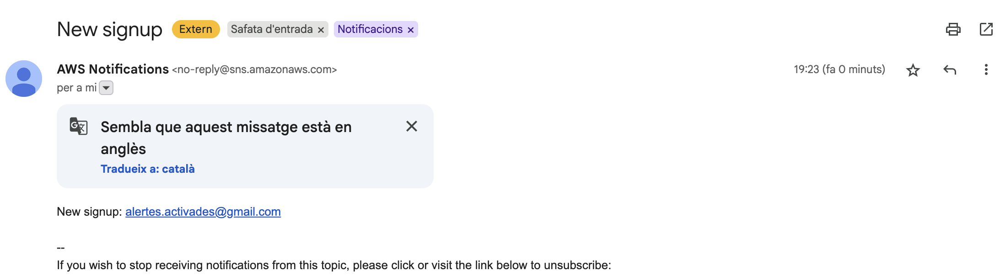
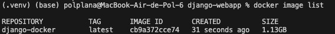
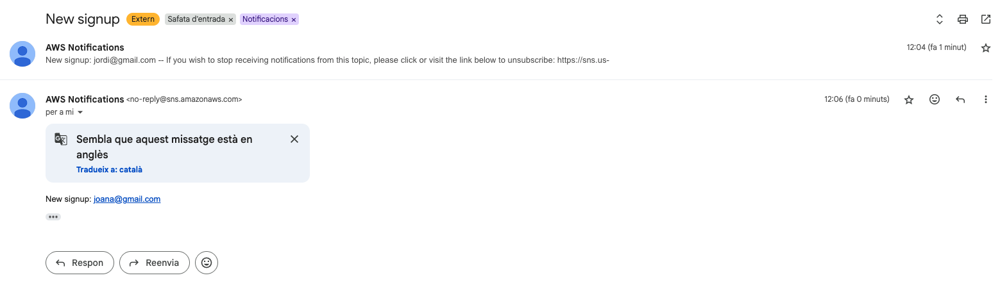
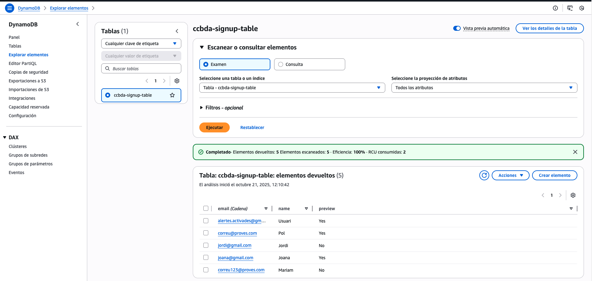
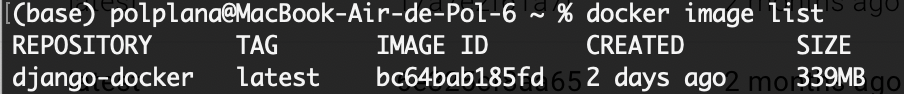
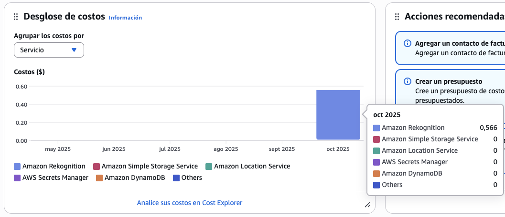

# 2026_1-4-19
## Team Members
- Mariam Delgado
- Pol Plana

## Task 4.3: Test the web app locally
### ❓ Question 1: Create a screen capture of your DynamoDB table with the data of the new leads. Add your thoughts on the above tasks.

The screenshot below shows the DynamoDB table ccbda-signup-table populated with two leads (two items using email as the partition key), created by submitting the newsletter form in the local Django app (http://127.0.0.1:8000/).

As we had created the table in us-east-1, we configured AWS CLI default profile to us-east-1. Then, we set up the project .env (making sure we had the proper .gitignore configuration). We also created and activated a fresh Python 3.13 virtualenv, installed requirements, ran migrations and started the dev server. Finally, we submitted two test sign-ups and confirmed items appeared in DynamoDB.

We think that it is important to use the least-privilege policy for the IAM created user, lab4_user (FullAccess to DynamoDB and AWS Simple Notification Service, as this are the only things to be used in this lab session). It was also important to check that we never commit .env (verified it’s gitignored). We say how if a certain policy is not activated, an AccessDenied errors occur, ensuring a proper permissions management.

## Task 4.4: Use AWS Simple Notification Service in your web app
### ❓ Question 2: Has everything gone alright? Share your thoughts on the task developed above.

Overall, the integration of AWS Simple Notification Service (SNS) into our web app went smoothly. We were able to set up the necessary configurations without problems and in a very straightforward and easy way. The process of publishing messages to the SNS topic from our Django app was straightforward, and we saw how simple it was to include a service that could take days of work if implemented from scratch. 

We confirmed that the messages were successfully delivered to the subscribed endpoints, as you can see in the screenshot below:

## Task 4.5: Configure Docker
### ❓ Question 3: Has everything gone alright? Share your thoughts on the task developed above.

Yes. The Docker image built successfully (see docker image list below), and the container ran with port binding 8080:8000 and the provided --env-file. The app was reachable at http://0.0.0.0:8080/, and logs confirmed normal Django startup plus successful operations: items added to DynamoDB and SNS messages sent.

## Task 4.6: Deploy the target web app
### ❓ Question 4: Share your thoughts on the task developed above.

The deployment task went very well. We successfully transitioned from a development-ready single container to a production-ready multi-container architecture using Docker Compose, which orchestrates both the Django app and PostgreSQL database with proper networking and volume persistence. The key improvement we implemented is that we switched from `python:3.13.2` to `python:3.13.2-slim`, reducing image size by more than 1GB. We also created `production.env` with `DATABASE=postgresql`, `DB_HOST=db` (container name), and PostgreSQL credentials, updated `requirements.txt` with `gunicorn` and `psycopg2-binary`, and configured `.dockerignore` to keep the image lean and secure.

## Task 4.7: Analisys of the twelve-factor app methodology
### ❓ Question 5: For the above lab session, explain, one by one, how each factor is taken into consideration, or what would you change or add to comply with each factor

- Codebase: The laboratory project has a single codebase stored in GitHub. From this repository, different deployments can be made. It could be improved by implementing a continuous integration and deployment (CI/CD) workflow.

- Dependencies: All project dependencies are declared in the requirements.txt file. In addition, virtual environments (venv) and later Docker containers are used, which ensures proper system isolation

- Config: Specific configurations are stored in environment variables defined in the .env file. This could be improved by using secret managers such as AWS Secrets Manager or Parameter Store.

- Backing services: External services are treated as attached resources, accessed through credentials and configurations defined in the environment. The PostgreSQL database service used with Docker Compose is also managed as an independent resource.

- Build, release, run: 
During the laboratory development, each of these stages is clearly distinguished:
  - Build: Creation of the Docker image.
  - Release: Environment configuration using variables and .env files.
  - Run: Execution of containers through docker run or docker compose up.

- Processes: The Django application runs as a stateless process within its container. Persistent data is managed externally through DynamoDB or PostgreSQL.

- Port binding: The application is exposed through port binding (0.0.0.0:8000) and published externally on port 8080 of the host. This allows the service to be accessed directly via HTTP. It could be improved by adding an NGINX reverse proxy in front of Gunicorn to enhance efficiency.

- Concurrency: Using Gunicorn with multiple workers enables concurrent request handling. In addition, Docker allows horizontal scaling by running multiple instances of the same container. The application could also be deployed in environments such as AWS ECS, EKS, or Kubernetes to support automatic scaling and dynamic load balancing.

- Disposability: Containers can start and stop quickly without affecting system availability, and persistent data is preserved in volumes or external services. Additionally, defining health checks and automatic restart policies in Docker Compose could ensure agile recovery in case of errors.

- Dev/prod parity: Thanks to Docker, the development and production environments are almost identical. Deployments should also be carried out using the same Docker images in the cloud to achieve full parity.

- Logs: Logs are managed through the container’s standard output (stdout and stderr), which can be viewed using the docker logs command. This allows them to be treated as event streams.

- Admin processes: Administrative tasks, such as database migrations or user creation, are executed as one-off processes within the container. These tasks could also be automated within the deployment flow (CI/CD pipeline).

## Submit Your Assignment
### ❓ Question 6: How much time did you spend on this session?
To complete this session, we spent approximately 7 hours in total. This time was divided among classwork, several gatherings in the library, and remote meetings.

### ❓ Question 7: What challenges did you encounter, and how did you overcome them?

The main challenge we encountered was understanding Docker and how to properly configure the Dockerfile. Initially, concepts like multi-stage builds, or certain configurations, were unclear. We overcame this by carefully reviewing the provided Dockerfile examples, reading Docker documentation, and experimenting with different configurations to see their effects on image size.

Overall, despite these initial challenges, the lab session was entertaining and interesting. We found it rewarding to see how Docker simplifies an expected future deployment and how easily we could integrate AWS services like DynamoDB and SNS into a real application. The hands-on experience with containerization and multi-container orchestration using Docker Compose provided valuable practical knowledge that will be useful in future projects, not only the ones involving this subject, but also in a professional context.

### ❓ Question 8: Using the AWS Billing and Cost Management Service, access the "Cost Explorer" and capture the cost of last week Using the "Dimension" "Service" where you can see how much did you spend to complete the session in total and per service.

In the cost explorer, no costs were directly registred, because we did not surpass the AWS Free Tier limits. If we explore the cost explorer, the costs are shown as 0 for this week. If we explore the free credits usage, we can see that no charges were made to the DynamoDB and SNS services we used, as shown in the image below. We can see a small cost for another service, related to the previous lab session. 

