# 2026_1-3-13
## Team Members
- Alexandra Olivares
- Pol Plana

## Task 1: Expand Your AWS Cloud Knowledge
### ❓ Question 1 [Module 8 – Databases]: Include screenshots of key steps and briefly explain what you learned or observed.
>I learned how to provision a managed database in AWS using RDS, configure networking with subnet groups, and securely connect the database to an EC2-hosted application.
>
>First screenshot: Shows the database creation process, where I selected the Standard create method and chose MySQL as the database engine.
>
>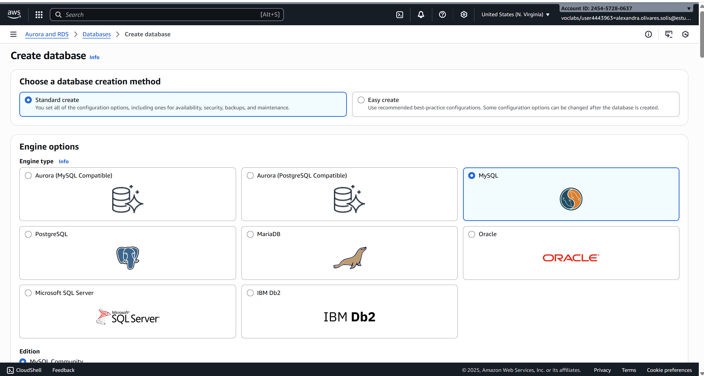
>
>Second screenshot: Displays the DB subnet group configuration, where I defined multiple subnets across different availability zones to ensure high availability and proper network setup.
>
>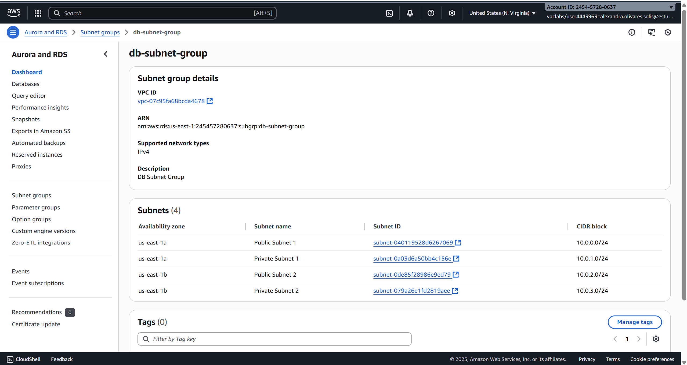

>Third screenshot: Illustrates the creation of an Aurora RDS instance, showcasing the options for selecting the instance type and configuring the database settings.
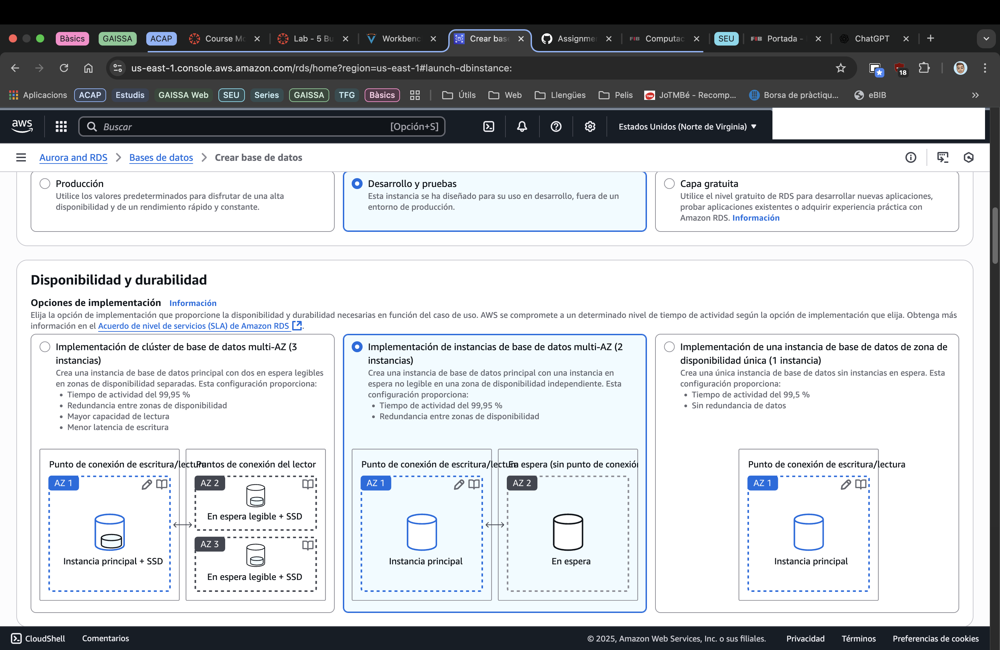
>
>Final screenshot: Shows the web interface of the PHP application successfully connected to the RDS database. I was able to view, edit, and add records, confirming that the integration between EC2 and RDS was working correctly.
>
>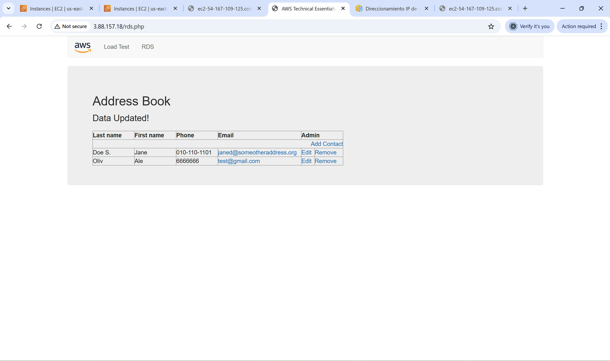
>
### ❓ Question 2 [Module 9 – Cloud Architecture]: Include screenshots of key steps and briefly explain what you learned or observed.

We consider this module the easiest one of the course, but this doesn't mean it is not as important as the others. In this module, we learned about the pillars of the AWS Well-Architecture Framework, which are essential for designing and operating operational excellent, reliable, secure, performance efficient, cost-effective, and sustainable systems in the cloud. The module consisted on watching a video explaining each pillar in detail, along with best practices and contexts, which helped us understand how to apply these principles when architecting solutions on AWS.

In the image below, we can see the pillars, that include Operational Excellence, Security, Reliability, Performance Efficiency, Cost Optimization, and Sustainability.

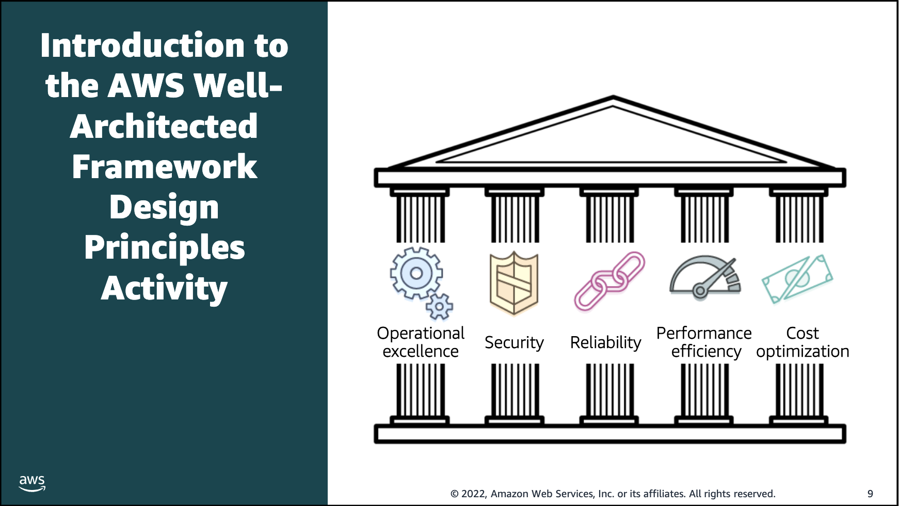

### ❓ Question 3 [Module 10 – Auto Scaling and Monitoring]: Include screenshots of key steps and briefly explain what you learned or observed.
This is the last module of the course, and I found it very interesting because it focuses on monitoring and auto-scaling, which are crucial for maintaining application performance and reliability in the cloud. It is very intersting how with a small effort, you can set up automatic scaling to handle varying loads, ensuring that your application remains responsive without manual intervention. We used CloudWatch to monitor our application's performance and set up alarms to trigger scaling actions. Then with EC2 Auto Scaling, we configured policies to automatically adjust the number of instances based on demand.

In the image below, you can see a video explaining the load balancing principles, concepts, and use cases.

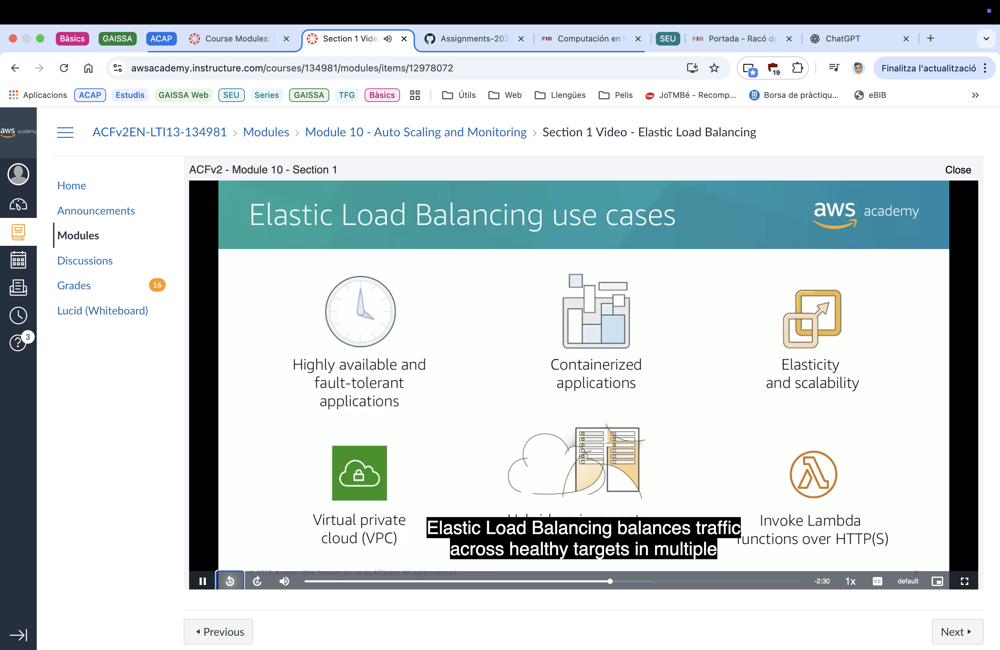


## Task 2: Extract Images from a Website
### ❓ Question 4: Reflect on the tasks above. What did you find interesting or challenging? Share your thoughts.
>
> Es interesante cómo se puede obtener información de distintas páginas, seleccionando exactamente lo que se desea para analizarlo posteriormente de forma adecuada.
>

## Task 3: Obtain Insights About an Image Using AWS Rekognition
### ❓ Question 5: Share your thoughts about the Rekognition demo. What did you observe? Was anything surprising or particularly useful?

> We found the Rekognition demo to be quite impressive in its ability to analyze images and provide detailed insights. Below, we list the different tools we tried in the demo and our observations for each one.

#### Label Detection
**Image 1 - Default tool image:** We found it surprising that a man with a skateboard in a very strange position is very well detected, and even people and cars from the background are detected, including wheels, even when being very small.

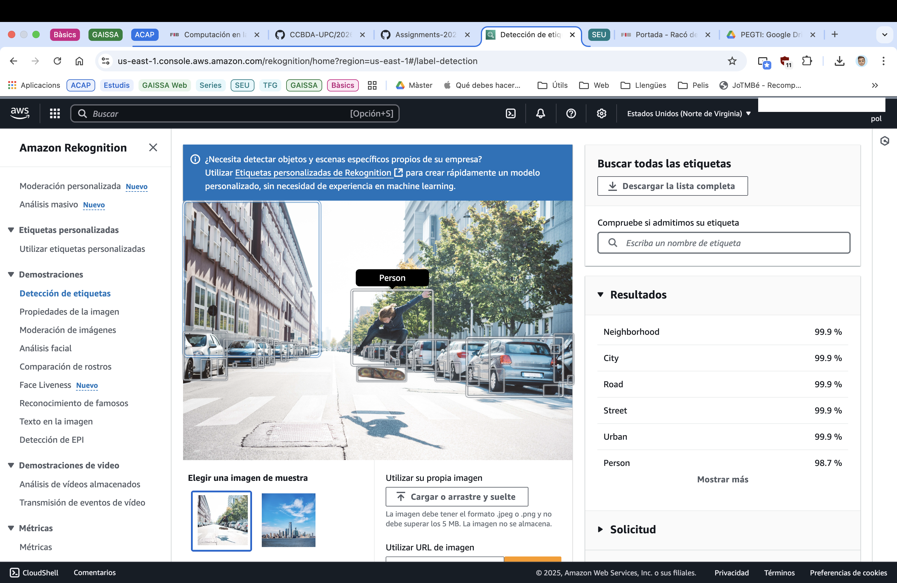

**Image 2 - UPC lab image:** We used an image from the UPC scrapped list showing a lab with two women. We found a very good detection of both the scene (lab is detected), elements, and people. However, there is one error with one of the women being detected as a man with very high certainty, showing it is very good, but not infallible.

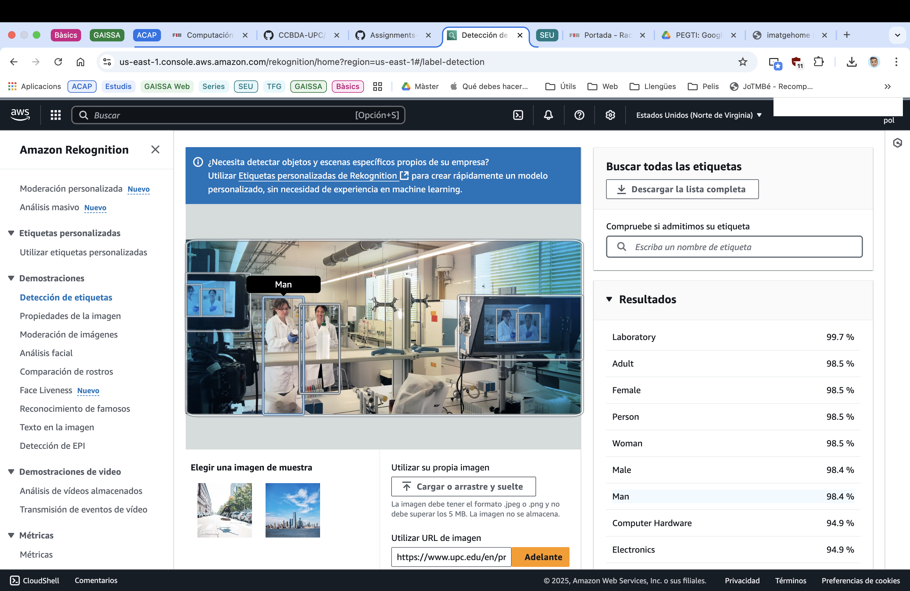

**Image 3 - JSON response:** Within the tools, we can see how the response types are made. We can see a JSON with Name: Female, Confidence, Instances (with the box situating them and individual confidence), Parents (Name: person). The "parents" relationship is particularly interesting, as it shows how the system categorizes items hierarchically, which can be useful for understanding broader categories and relationships between detected objects. This also makes us reflect on how the system could be implemented for more complex scenarios, where understanding the relationships between objects is crucial.

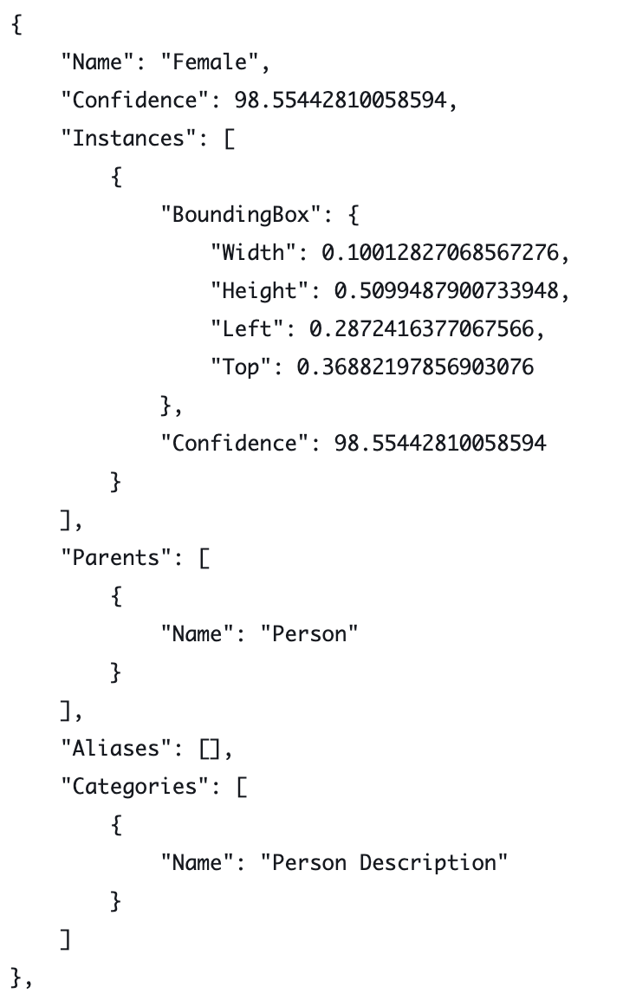

#### Image Properties
**Images 4 & 5 - UPC images:** Images found in the UPC scraping, showing the first one a range of blues and greens degradate. The second one is an image that is entirely blue, showing different tones.

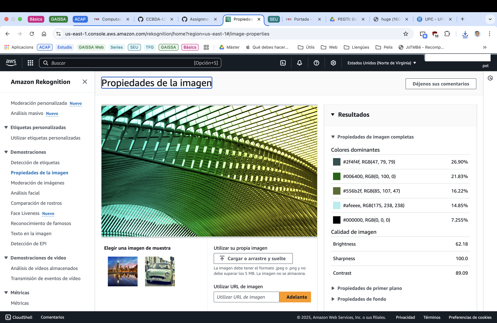
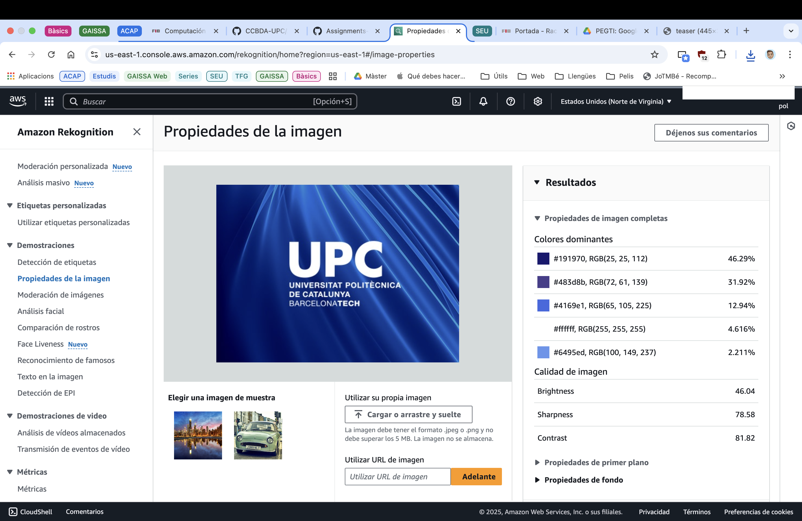

#### Image Moderation
**Image 6 - Bikini image:** Non-nudity image of a woman on the beach, doing yoga in a bikini. It is detected as non-explicit but categorized as underwear.

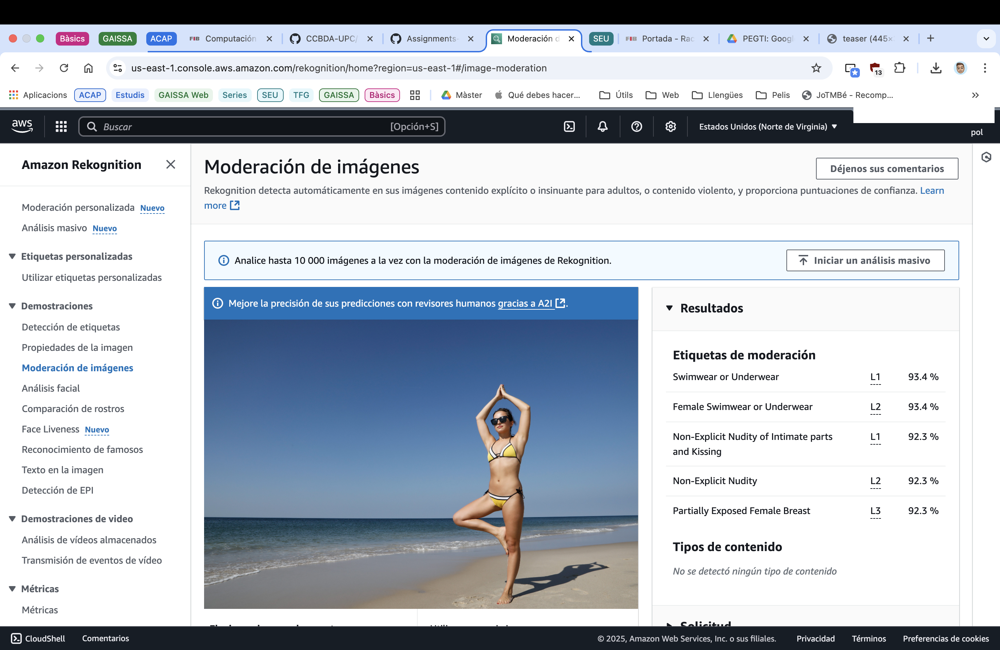

**Image 7 - Animated content:** The same tool but in this case no moderation labels were found, however the type of content is seen as "animated".

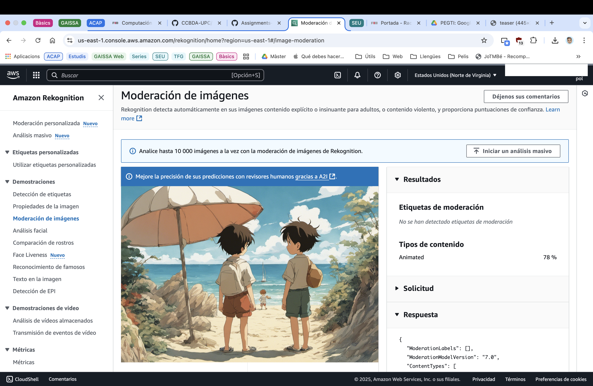

#### Face Detection
**Image 8 - UPC language image:** An image from UPC language showing 3 people. All of them have been identified and we can see an output for each face. Each face shows information such as the certainty for: looks like a face, appears to be male, age range, smiling, appears to be happy, not wearing glasses, not wearing sunglasses, eyes are open, mouth is open. We think this is very useful information, and it is surprising how well it works, even when the faces are not very large in the image. We have tried images were the face is sideways or partially covered, and it still works quite well.

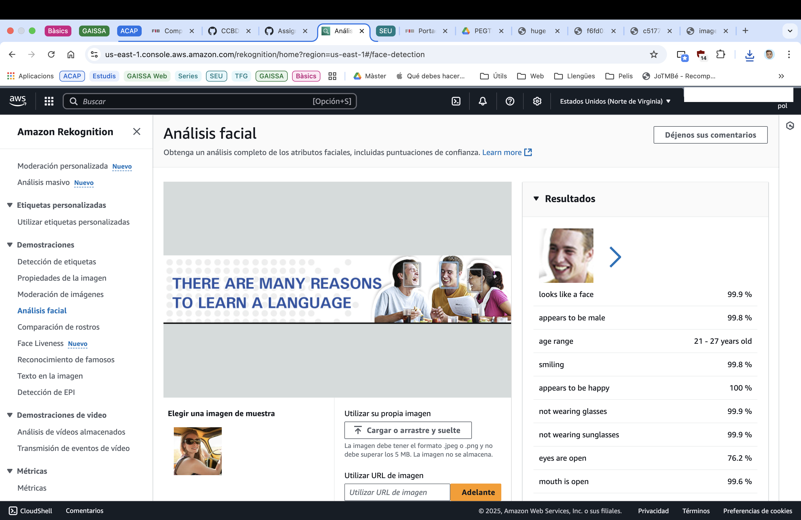

#### Face Comparison
**Image 9 - Age comparison:** Default image by the tool, where we can see how two people compare in two images, seeing if a person is the same (even when they have different ages as in the image).

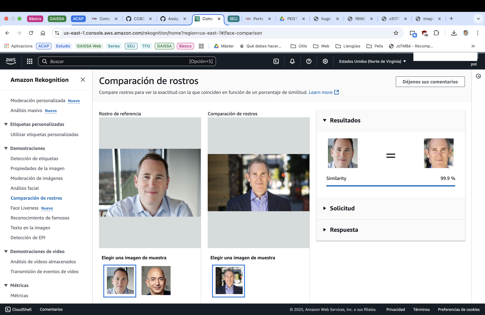

#### Face Liveness
**Image 10 - Liveness test:** We tried this new feature, which required us to record our face in real-time. It is very similar to the kind of verification that some banks use to verify the identity of a person. We found it very interesting, as it is a very useful tool for security and fraud prevention.

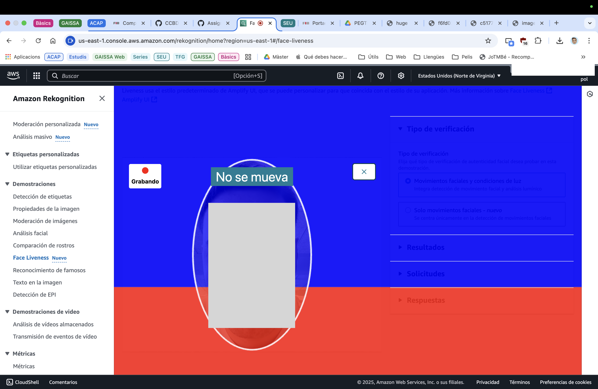

**Image 11 - Liveness result:** In the end, it was completed with a 99.12% confidence that the user is really in front of the camera, and not a fake video.

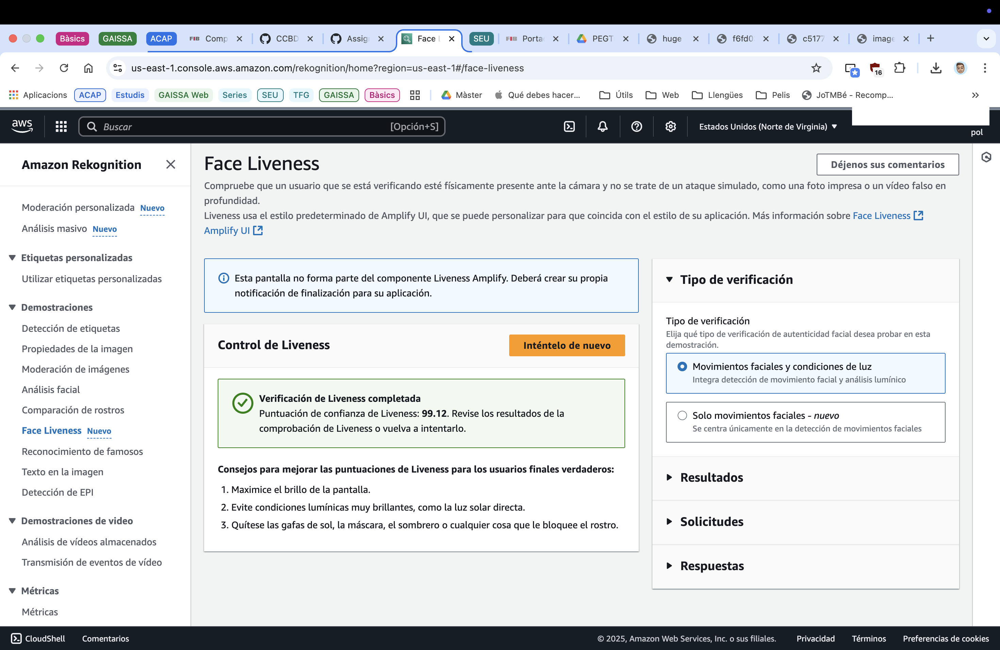

#### Celebrity Detection
**Image 12 - Rosalía:** Rosalía's image being detected with her face and a 99.9% confidence.

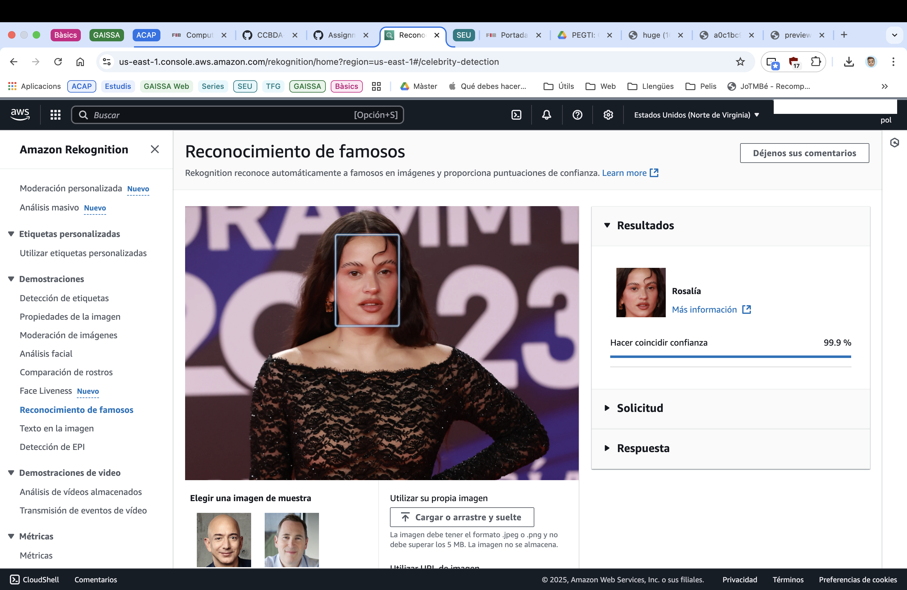

**Image 13 - UPC Rectors (failed detection):** We tried with much less famous people, but still public figures, in this case the last two UPC rectors. The system found a coincidence, but it was incorrect. Despite this, as we see in the image, the rector Francesc Torres was detected as Phillip Green. We can see that when we look up an image of Phillip Green, the physiological similarity with the rector is very high! This surprised us, even when it is a fail.


#### Text Detection
**Image 14 - UPC text:** Detection of UPC name text in an image. We have also tried with other images with text that has occlusions, different angles, and different lighting conditions, and it still works quite well. Despite that, we must note that in case of occlusions it returns a literal transcription of what it sees, which can lead to errors. This is understandable, as it is literally reading what it sees, but it is something to keep in mind (specific tools might want to apply a post-processing step).

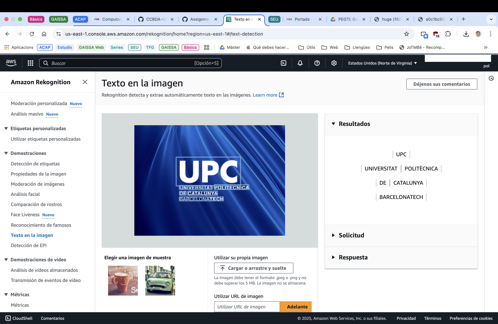

#### PPE Detection (EPI in Catalan)
**Image 15 - Lab safety equipment:** Detection of hand cover (gloves) on a woman from a picture of a UPC lab. It also detects that she has an element on her face (glasses).

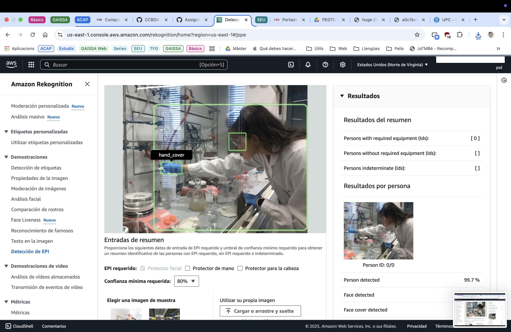

### ❓ Question 6: What differences or similarities did you find between the JSON output and the console demo? Which one provides more usable information, and why?

Here we can see the json obtain by the python script

```json
{
    "Labels": [
        {
            "Name": "Grass",
            "Confidence": 99.98262786865234,
            "Instances": [],
            "Parents": [
                {
                    "Name": "Plant"
                }
            ],
            "Aliases": [],
            "Categories": [
                {
                    "Name": "Plants and Flowers"
                }
            ]
        },
        {
            "Name": "Plant",
            "Confidence": 99.98262786865234,
            "Instances": [],
            "Parents": [],
            "Aliases": [],
            "Categories": [
                {
                    "Name": "Plants and Flowers"
                }
            ]
        },
        {
            "Name": "Person",
            "Confidence": 99.39205932617188,
            "Instances": [
                {
                    "BoundingBox": {
                        "Width": 0.0834556296467781,
                        "Height": 0.44144827127456665,
                        "Left": 0.5763291716575623,
                        "Top": 0.5035720467567444
                    },
                    "Confidence": 99.39205932617188
                },
                {
                    "BoundingBox": {
                        "Width": 0.09640753269195557,
                        "Height": 0.4380345046520233,
                        "Left": 0.36009639501571655,
                        "Top": 0.5089521408081055
                    },
                    "Confidence": 99.00366973876953
                },
                {
                    "BoundingBox": {
                        "Width": 0.06698541343212128,
                        "Height": 0.4023207426071167,
                        "Left": 0.5229027271270752,
                        "Top": 0.5449785590171814
                    },
                    "Confidence": 98.71110534667969
                },
                {
                    "BoundingBox": {
                        "Width": 0.08391927927732468,
                        "Height": 0.3963219225406647,
                        "Left": 0.44540902972221375,
                        "Top": 0.5455851554870605
                    },
                    "Confidence": 98.47283935546875
                }
            ],
            "Parents": [],
            "Aliases": [
                {
                    "Name": "Human"
                }
            ],
            "Categories": [
                {
                    "Name": "Person Description"
                }
            ]
        },
        {
            "Name": "Architecture",
            "Confidence": 96.7999267578125,
            "Instances": [],
            "Parents": [],
            "Aliases": [],
            "Categories": [
                {
                    "Name": "Buildings and Architecture"
                }
            ]
        },
        {
            "Name": "Building",
            "Confidence": 96.7999267578125,
            "Instances": [],
            "Parents": [
                {
                    "Name": "Architecture"
                }
            ],
            "Aliases": [],
            "Categories": [
                {
                    "Name": "Buildings and Architecture"
                }
            ]
        },
        {
            "Name": "College",
            "Confidence": 96.7999267578125,
            "Instances": [],
            "Parents": [
                {
                    "Name": "Architecture"
                },
                {
                    "Name": "Building"
                }
            ],
            "Aliases": [],
            "Categories": [
                {
                    "Name": "Education"
                }
            ]
        },
        {
            "Name": "Clothing",
            "Confidence": 89.816650390625,
            "Instances": [],
            "Parents": [],
            "Aliases": [
                {
                    "Name": "Apparel"
                }
            ],
            "Categories": [
                {
                    "Name": "Apparel and Accessories"
                }
            ]
        },
        {
            "Name": "Footwear",
            "Confidence": 89.816650390625,
            "Instances": [],
            "Parents": [
                {
                    "Name": "Clothing"
                }
            ],
            "Aliases": [],
            "Categories": [
                {
                    "Name": "Apparel and Accessories"
                }
            ]
        },
        {
            "Name": "Shoe",
            "Confidence": 89.816650390625,
            "Instances": [
                {
                    "BoundingBox": {
                        "Width": 0.034497618675231934,
                        "Height": 0.038346558809280396,
                        "Left": 0.41538968682289124,
                        "Top": 0.8944715261459351
                    },
                    "Confidence": 89.816650390625
                },
                {
                    "BoundingBox": {
                        "Width": 0.031800657510757446,
                        "Height": 0.03026428259909153,
                        "Left": 0.624544620513916,
                        "Top": 0.9130716323852539
                    },
                    "Confidence": 81.16217041015625
                }
            ],
            "Parents": [
                {
                    "Name": "Clothing"
                },
                {
                    "Name": "Footwear"
                }
            ],
            "Aliases": [],
            "Categories": [
                {
                    "Name": "Apparel and Accessories"
                }
            ]
        },
        {
            "Name": "Lawn",
            "Confidence": 89.8125228881836,
            "Instances": [],
            "Parents": [
                {
                    "Name": "Grass"
                },
                {
                    "Name": "Plant"
                }
            ],
            "Aliases": [],
            "Categories": [
                {
                    "Name": "Home and Indoors"
                }
            ]
        }
    ],
    "LabelModelVersion": "3.0",
    "ResponseMetadata": {
        "RequestId": "bd777b4e-154d-4b49-bf82-5882f4be7f74",
        "HTTPStatusCode": 200,
        "HTTPHeaders": {
            "x-amzn-requestid": "bd777b4e-154d-4b49-bf82-5882f4be7f74",
            "content-type": "application/x-amz-json-1.1",
            "content-length": "2551",
            "date": "Tue, 14 Oct 2025 20:16:25 GMT"
        },
        "RetryAttempts": 0
    }
}
        "RequestId": "bd777b4e-154d-4b49-bf82-5882f4be7f74",
        "HTTPStatusCode": 200,
        "HTTPHeaders": {
            "x-amzn-requestid": "bd777b4e-154d-4b49-bf82-5882f4be7f74",
            "content-type": "application/x-amz-json-1.1",
            "content-length": "2551",
        "RequestId": "bd777b4e-154d-4b49-bf82-5882f4be7f74",
        "HTTPStatusCode": 200,
        "HTTPHeaders": {
        "RequestId": "bd777b4e-154d-4b49-bf82-5882f4be7f74",
        "RequestId": "bd777b4e-154d-4b49-bf82-5882f4be7f74", 
        "HTTPStatusCode": 200,
        "HTTPHeaders": {
            "x-amzn-requestid": "bd777b4e-154d-4b49-bf82-5882f4be7f74",
            "content-type": "application/x-amz-json-1.1",    
            "content-length": "2551",
            "date": "Tue, 14 Oct 2025 20:16:25 GMT"
        },
        "RetryAttempts": 0
    }
}
```
And here we can see the json obtein by the console, with the same picture as the python script.

```json
{
    "Labels": [
        {
            "Name": "Grass",
            "Confidence": 99.98262786865234,
            "Instances": [],
            "Parents": [
                {
                    "Name": "Plant"
                }
            ],
            "Aliases": [],
            "Categories": [
                {
                    "Name": "Plants and Flowers"
                }
            ]
        },
        {
            "Name": "Plant",
            "Confidence": 99.98262786865234,
            "Instances": [],
            "Parents": [],
            "Aliases": [],
            "Categories": [
                {
                    "Name": "Plants and Flowers"
                }
            ]
        },
        {
            "Name": "Person",
            "Confidence": 99.39205932617188,
            "Instances": [
                {
                    "BoundingBox": {
                        "Width": 0.0834556296467781,
                        "Height": 0.44144827127456665,
                        "Left": 0.5763291716575623,
                        "Top": 0.5035720467567444
                    },
                    "Confidence": 99.39205932617188
                },
                {
                    "BoundingBox": {
                        "Width": 0.09640753269195557,
                        "Height": 0.4380345046520233,
                        "Left": 0.36009639501571655,
                        "Top": 0.5089521408081055
                    },
                    "Confidence": 99.00366973876953
                },
                {
                    "BoundingBox": {
                        "Width": 0.06698541343212128,
                        "Height": 0.4023207426071167,
                        "Left": 0.5229027271270752,
                        "Top": 0.5449785590171814
                    },
                    "Confidence": 98.71110534667969
                },
                {
                    "BoundingBox": {
                        "Width": 0.08391927927732468,
                        "Height": 0.3963219225406647,
                        "Left": 0.44540902972221375,
                        "Top": 0.5455851554870605
                    },
                    "Confidence": 98.47283935546875
                }
            ],
            "Parents": [],
            "Aliases": [
                {
                    "Name": "Human"
                }
            ],
            "Categories": [
                {
                    "Name": "Person Description"
                }
            ]
        },
        {
            "Name": "Architecture",
            "Confidence": 96.7999267578125,
            "Instances": [],
            "Parents": [],
            "Aliases": [],
            "Categories": [
                {
                    "Name": "Buildings and Architecture"
                }
            ]
        },
        {
            "Name": "Building",
            "Confidence": 96.7999267578125,
            "Instances": [],
            "Parents": [
                {
                    "Name": "Architecture"
                }
            ],
            "Aliases": [],
            "Categories": [
                {
                    "Name": "Buildings and Architecture"
                }
            ]
        },
        {
            "Name": "College",
            "Confidence": 96.7999267578125,
            "Instances": [],
            "Parents": [
                {
                    "Name": "Architecture"
                },
                {
                    "Name": "Building"
                }
            ],
            "Aliases": [],
            "Categories": [
                {
                    "Name": "Education"
                }
            ]
        },
        {
            "Name": "Clothing",
            "Confidence": 89.816650390625,
            "Instances": [],
            "Parents": [],
            "Aliases": [
                {
                    "Name": "Apparel"
                }
            ],
            "Categories": [
                {
                    "Name": "Apparel and Accessories"
                }
            ]
        },
        {
            "Name": "Footwear",
            "Confidence": 89.816650390625,
            "Instances": [],
            "Parents": [
                {
                    "Name": "Clothing"
                }
            ],
            "Aliases": [],
            "Categories": [
                {
                    "Name": "Apparel and Accessories"
                }
            ]
        },
        {
            "Name": "Shoe",
            "Confidence": 89.816650390625,
            "Instances": [
                {
                    "BoundingBox": {
                        "Width": 0.034497618675231934,
                        "Height": 0.038346558809280396,
                        "Left": 0.41538968682289124,
                        "Top": 0.8944715261459351
                    },
                    "Confidence": 89.816650390625
                },
                {
                    "BoundingBox": {
                        "Width": 0.031800657510757446,
                        "Height": 0.03026428259909153,
                        "Left": 0.624544620513916,
                        "Top": 0.9130716323852539
                    },
                    "Confidence": 81.16217041015625
                }
            ],
            "Parents": [
                {
                    "Name": "Clothing"
                },
                {
                    "Name": "Footwear"
                }
            ],
            "Aliases": [],
            "Categories": [
                {
                    "Name": "Apparel and Accessories"
                }
            ]
        },
        {
            "Name": "Lawn",
            "Confidence": 89.8125228881836,
            "Instances": [],
            "Parents": [
                {
                    "Name": "Grass"
                },
                {
                    "Name": "Plant"
                }
            ],
            "Aliases": [],
            "Categories": [
                {
                    "Name": "Home and Indoors"
                }
            ]
        },
        {
            "Name": "Landmark",
            "Confidence": 59.97163772583008,
            "Instances": [],
            "Parents": [],
            "Aliases": [],
            "Categories": [
                {
                    "Name": "Popular Landmarks"
                }
            ]
        },
        {
            "Name": "Tree",
            "Confidence": 57.618309020996094,
            "Instances": [],
            "Parents": [
                {
                    "Name": "Plant"
                }
            ],
            "Aliases": [],
            "Categories": [
                {
                    "Name": "Nature and Outdoors"
                }
            ]
        },
        {
            "Name": "Vegetation",
            "Confidence": 55.13107681274414,
            "Instances": [],
            "Parents": [
                {
                    "Name": "Plant"
                }
            ],
            "Aliases": [],
            "Categories": [
                {
                    "Name": "Nature and Outdoors"
                }
            ]
        }
    ],
    "LabelModelVersion": "3.0"
}
```
We compared these and other examples and found that the console surfaces more labels overall, but many of them have lower confidence scores. In contrast, the Python output is more conservative, returning fewer labels with higher confidence. As a result, the Python results are better suited for reliable, production-grade analysis, while the console view is handy for exploratory inspection where breadth matters more than precision.


## Task 4: Get Insights From Website Images Using AWS Rekognition
### ❓ Question 7: What is the goal of your image analysis application? (E.g., detecting objects, filtering inappropriate content, facial recognition, etc.)

> **Goal**: Extract insights from web images by analyzing images scraped from the UPC website using AWS Rekognition.
>
> The application (`Recognize_2.py`) performs the following:
> 1. Reads image URLs from the web scraper output (`images.json`)
> 2. Downloads images from those URLs
> 3. Analyzes each image using AWS Rekognition's label detection
> 4. Extracts insights about what content appears across different web pages
> 5. Generates a summary showing the most common detected labels and patterns across the website
>
> This allows us to understand what type of visual content the UPC website contains (e.g., people, buildings, technology, laboratory equipment) and how images are distributed across different pages.
>
> **Results from our analysis:**
>
> We analyzed **485 images** from **44 different web pages** on the UPC website, detecting **458 unique labels** in total. The insights summary is available in `Recognize_2_web_insights_summary.json`.
>
> **Top 10 most detected labels across all images:**
> 1. **Person** - 205 occurrences (97.3% avg confidence)
> 2. **Adult** - 134 occurrences (97.6% avg confidence)
> 3. **Male** - 92 occurrences (97.5% avg confidence)
> 4. **Man** - 89 occurrences (97.5% avg confidence)
> 5. **People** - 84 occurrences (96.2% avg confidence)
> 6. **Text** - 71 occurrences (85.5% avg confidence)
> 7. **Woman** - 67 occurrences (97.8% avg confidence)
> 8. **Female** - 65 occurrences (97.8% avg confidence)
> 9. **Electronics** - 52 occurrences (92.7% avg confidence)
> 10. **Outdoors** - 49 occurrences (88.5% avg confidence)
>
> **Key insights:**
> - The UPC website predominantly features **people** (students, faculty, staff) in various contexts
> - **Educational settings** are well-represented (electronics, laptops, monitors in classrooms/labs)
> - **Diversity** is visible with balanced detection of male and female subjects
> - The home page (`https://www.upc.edu/en/`) contained the most images (210), showing diverse content with 103 unique labels
> - Text detection was common, indicating many images include informational overlays or signage
> - The insights reveal that UPC presents itself as a **people-focused, technology-enabled educational institution** 

### ❓ Question 8: What is the mechanism that you have created to prevent sending the same image to AWS Rekognition more than once?

> We implemented a **hash-based caching system** with two different approaches:
>
> **For `Recognize_1.py` (local images):**
> - Calculates an MD5 hash of the image file content
> - Stores analyzed image hashes in `rekognition_results/analyzed_images.json`
> - Before analyzing, checks if the file hash exists in the cache
> - If found, skips analysis; if not, analyzes and adds hash to cache
> - **Advantage**: Detects duplicate images even with different filenames
>
> **For `Recognize_2.py` (web images):**
> - Calculates an MD5 hash of the image URL
> - Stores analyzed URL hashes in `web_insights/analyzed_web_images.json`
> - Before downloading/analyzing, checks if the URL hash exists in the cache
> - If found, skips download and analysis; if not, proceeds and adds hash to cache
> - **Advantage**: Prevents re-downloading and re-analyzing the same web resource
>
> **Why this approach?**
> - **Cost-effective**: Prevents duplicate API calls to AWS Rekognition, which saves money
> - **Efficient**: Avoids unnecessary downloads and processing
> - **Persistent**: Cache survives between script executions
> - **Reliable**: MD5 hashing ensures accurate duplicate detection
>
> The cache files can be manually deleted or modified if re-analysis is needed for specific images.


## Submit Your Assignment
### ❓ Question 9: How much time did you spend on this session?

### ❓ Question 10: Using the AWS Billing and Cost Management Service, access the "Cost Explorer" and capture the cost of last week Using the "Dimension" "Service" where you can see how much did you spend to complete the session in total and per service.

> **Total cost for this lab session: $0.07 USD**
It must be noted that the cost does not reflect the actual usage of the day, as AWS billing updates with a delay. However, we can see that the cost is very low, which is expected given that we stayed within the free tier limits for Rekognition usage. In fact, the free tier allows for 5,000 images per month, and we only approximately 500 images in total.
>
> We accessed the AWS Billing and Cost Management dashboard to review our usage and costs. The analysis shows:
> 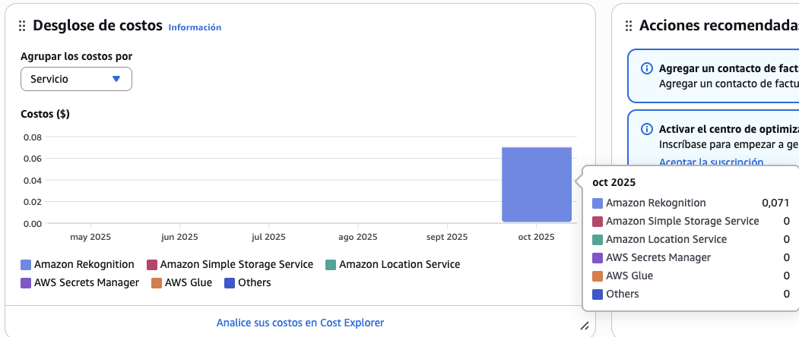
> Note that if we selected the "Last 7 days" option, the cost appears as $0.00, so we opted to include the monthly view that shows the $0.07 cost. Even though the cost is low, it is clearly not reflecting the actual usage of the day 15th October.
>
>We also included some additional screenshots showing the different Rekognition metrics available in AWS CloudWatch for the last days:
> 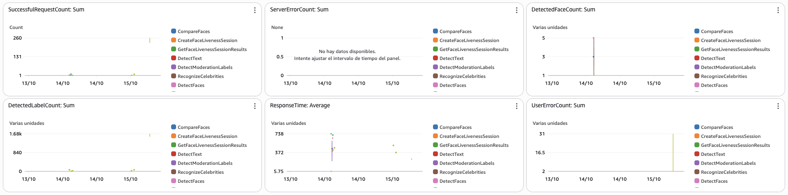


### ❓ Question 11: What challenges did you encounter, and how did you overcome them?


