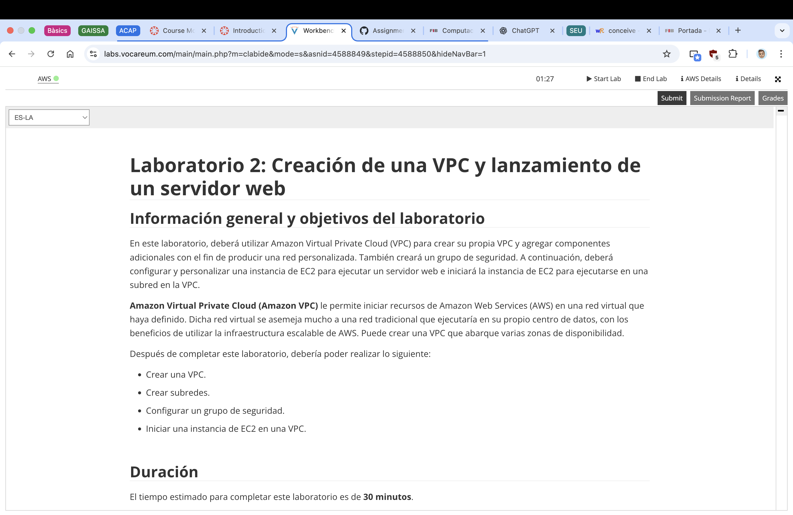
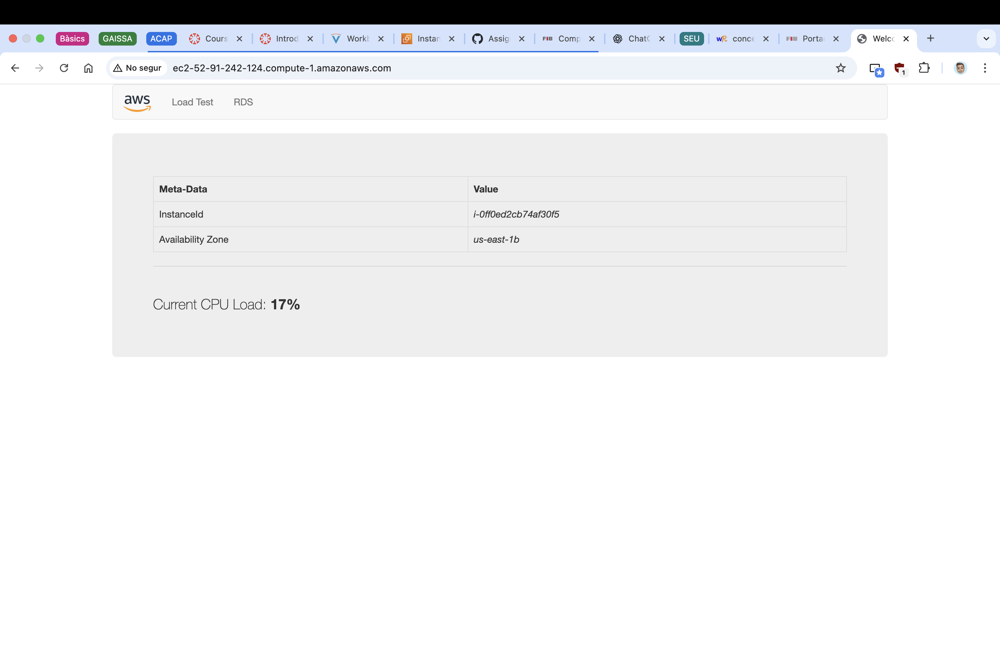
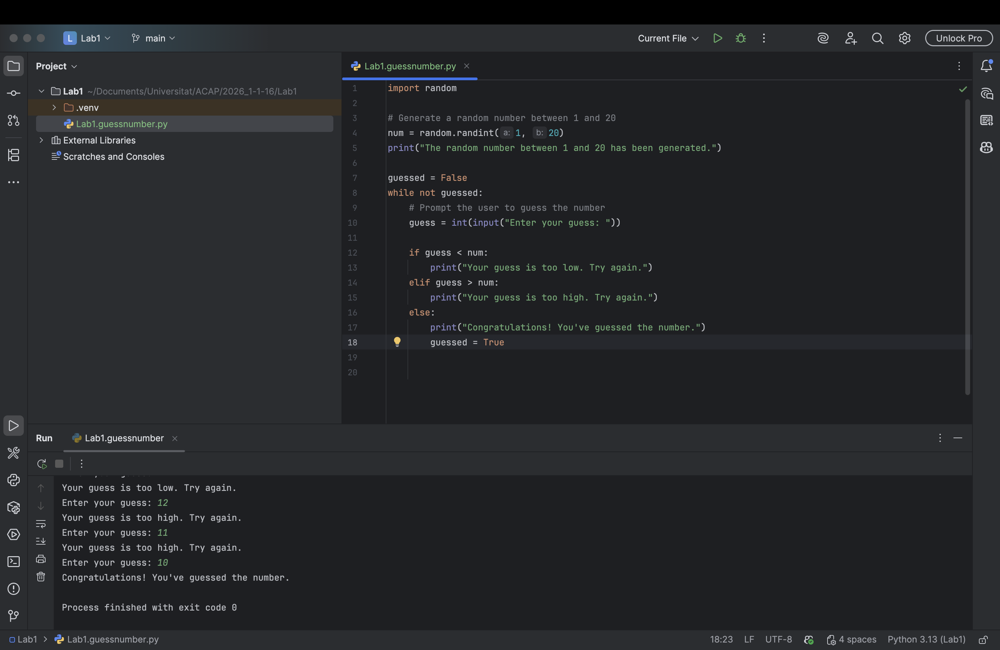

# 2026-1-xx

## Task 1: Continue Learning About the AWS Cloud
### ❓ Question 1: Include screenshots of key steps and briefly explain what you learned or observed

### ❓ Question 2: Include screenshots of key steps and briefly explain what you learned or observed.
In this task, we continued our learning journey with AWS by completing courses 5 from the AWS Academy Cloud Foundations series. This course focuses on Networking and Content Delivery. We learned about the fundamental concepts of networking in the cloud, including Virtual Private Clouds (VPCs), subnets, route tables, and internet gateways. The course also covered how to set up and configure these components to create a secure and efficient network architecture in AWS.

We observed how VPCs allow us to isolate our cloud resources and control their communication with each other and the internet. We also learned about the importance of security groups and network access control lists (ACLs) in protecting our resources from unauthorized access. Some of this concepts were a bit complex, but we took our time to understand them and reviewed the material as needed. Understanding the different components of a VPC and how they interact with each other has been the most difficult part of the task, but we managed to grasp the concepts through the course material and additional research.

In the screenshots below, you can see some of the key steps we took during the course, including the course overview when starting the laboratory environment, VPC configuration in AWS, and an example of launching an EC2 instance within our own VPC.

## Task 3: Write a Python Program with the random Library
### ❓ Question 3: Include screenshots of key steps and briefly explain what you learned or observed.
We learned the key basics of Python programming, including how to set up a Python development environment using PyCharm, write a simple Python program that utilizes the `random` library to generate random numbers, and run the program within the IDE. In our case, Python is not our first programming language, so we had to familiarize ourselves and remember its syntax and conventions. This exercise helped us understand the syntax and structure of Python code, as well as how to use libraries to enhance functionality.

In the screenshots below, you can see the configured PyCharm interface with the Python program that generates a random number between 1 and 20. It represents the most key step as it can be seen how we have coded the program and executed it to test the output.

## Submit Your Assignment
### ❓ Question 4: How much time did you spend on this session?
To complete the tasks in this session, we spent approximately 4 hours. This time was divided between learning about AWS Cloud services (the AWS courses 5 and 6 took approximately 2 hours in total), setting up the Python development environment, writing the Python program, and answering the questions in this assignment.

### ❓ Question 5: What challenges did you encounter, and how did you overcome them?
During the laboratory session, we encountered a few challenges, but we managed to overcome them successfully.

The first challenge was understanding some of the more complex concepts in the AWS courses, particularly in course 5, which covered networking and VPC concepts. To overcome this, we took our time to review the material, and checked the concepts in external sources to conceive a clearer understanding.

The second challenge was recalling Python syntax and conventions, as it is not our first programming language. We overcame this by referring to Python documentation in this course and examples online to refresh our memory, and succeed in this session's task. 

Overall, we worked well and got along as a team, supporting each other through the challenges and ensuring that we completed the tasks successfully.
