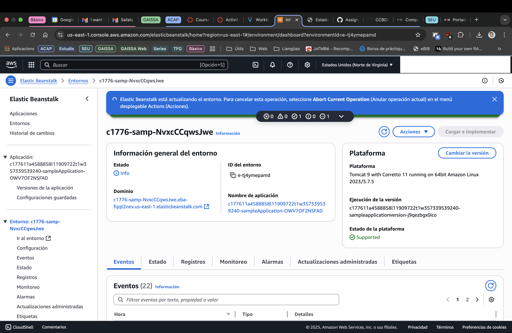

# 2026_1-2-20
## Team Members
- Zhehan Xiang
- Pol Plana

## Task 1: Deepen Your AWS Cloud Knowledge
### ❓ Question 1: Include screenshots of key steps and briefly explain what you learned or observed.
In this task, we continued our AWS course by completing the module 6, focused on computing services. We learned how to create and deploy an EC2 instance, a Lambda function, and an Elastic Beanstalk application.
We observed that AWS provides a wide range of computing services that can be used to deploy and manage applications in the cloud. We also learned about the different pricing models for these services, including on-demand, reserved, and spot instances.
The most challenging part of this task was to understand the different configurations and settings for each service. However, the step-by-step instructions provided in the module were very helpful in guiding us through the process. In particular, the fac this module not ony includes a lab and a quiz, but also two activities  that allow us to practice in a real AWS environment.

In previous modules, we had already created an EC2 instance, so we think he main advance in this one is on creating a Lambda function and an Elastic Beanstalk application.
In the image below, we can see the different steps we followed to create a Lambda function that runs a simple Python script. We also created an Elastic Beanstalk application that deploys a web application using a pre-configured environment.

### ❓ Question 2: Include screenshots of key steps and briefly explain what you learned or observed.

## Task 2: Getting Started with NLTK
### ❓ Question 4: Add the code to WordCountTensorFlow_2.py and your comments to `README.md

### ❓ Question 5: Why isn’t "TensorFlow" the most frequent word?

### ❓ Question 6: Which are the Stop Words?

### ❓ Question 7: Add the code to WordCountTensorFlow_3.py and your comments to `README.md

## Task 3: Using the BlueSky API in Python
### ❓ Question 8: Did the data print correctly?

INFO:httpx:HTTP Request: POST https://bsky.social/xrpc/com.atproto.server.createSession "HTTP/1.1 200 OK"
INFO:httpx:HTTP Request: GET https://pholiota.us-west.host.bsky.network/xrpc/app.bsky.actor.getProfile?actor=zhehan02.bsky.social "HTTP/1.1 200 OK"
INFO:__main__:Login successful. Welcome, !
INFO:httpx:HTTP Request: POST https://pholiota.us-west.host.bsky.network/xrpc/com.atproto.repo.createRecord "HTTP/1.1 200 OK"
INFO:__main__:Post sent successfully: at://did:plc:r5jq6sggdoy6v6q5mnusu3zf/app.bsky.feed.post/3m27uhiwqot2e
INFO:httpx:HTTP Request: POST https://pholiota.us-west.host.bsky.network/xrpc/com.atproto.repo.createRecord "HTTP/1.1 200 OK"
INFO:__main__:Post liked successfully: at://did:plc:r5jq6sggdoy6v6q5mnusu3zf/app.bsky.feed.post/3m27uhiwqot2e

### ❓ Question 9: Add the code to BlueSky_2.py and your comments to `README.md

## Task 4: Posts pre-processing
### ❓ Question 10: Add the code to BlueSky_3.py and your comments to README.md.

## Submit Your Assignment
### ❓ Question 11: How much time did you spend on this session?

### ❓ Question 12: What challenges did you encounter, and how did you overcome them?

