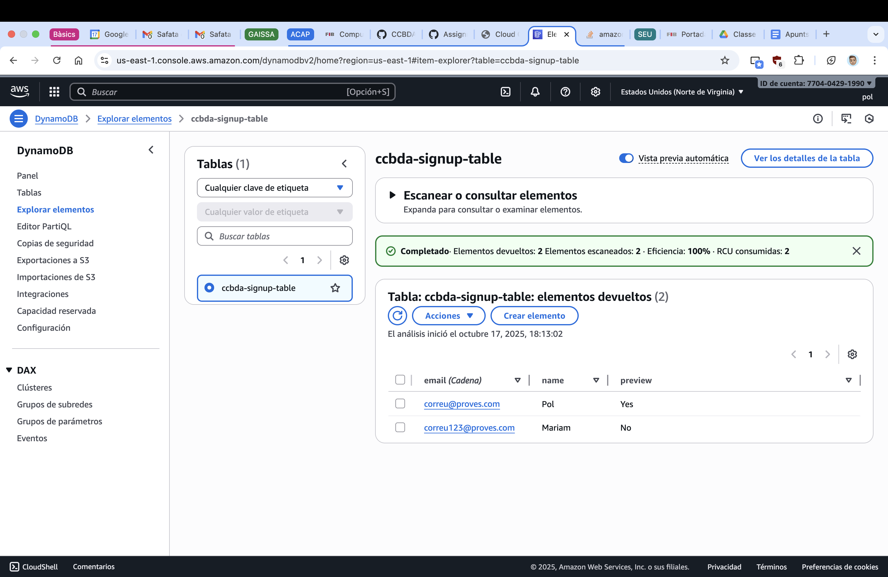
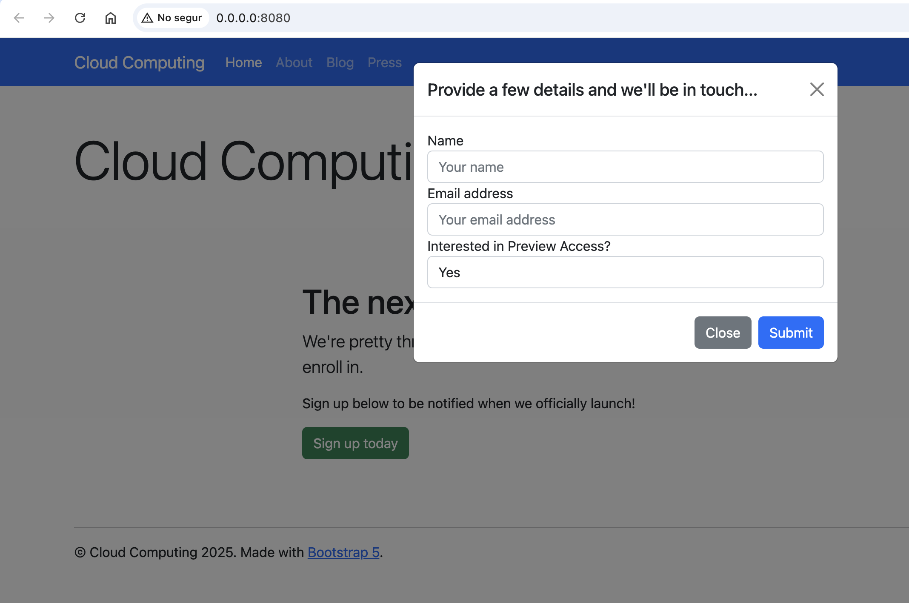
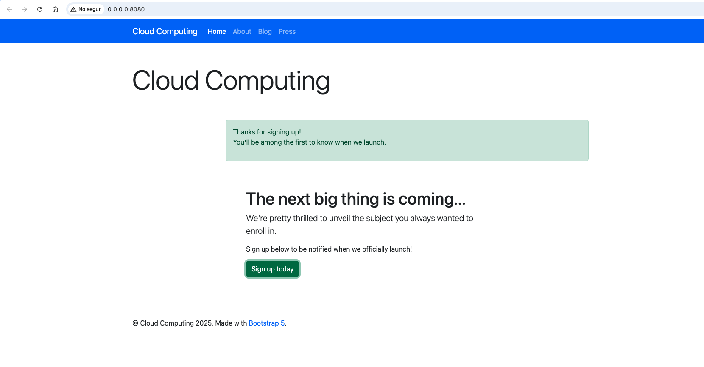
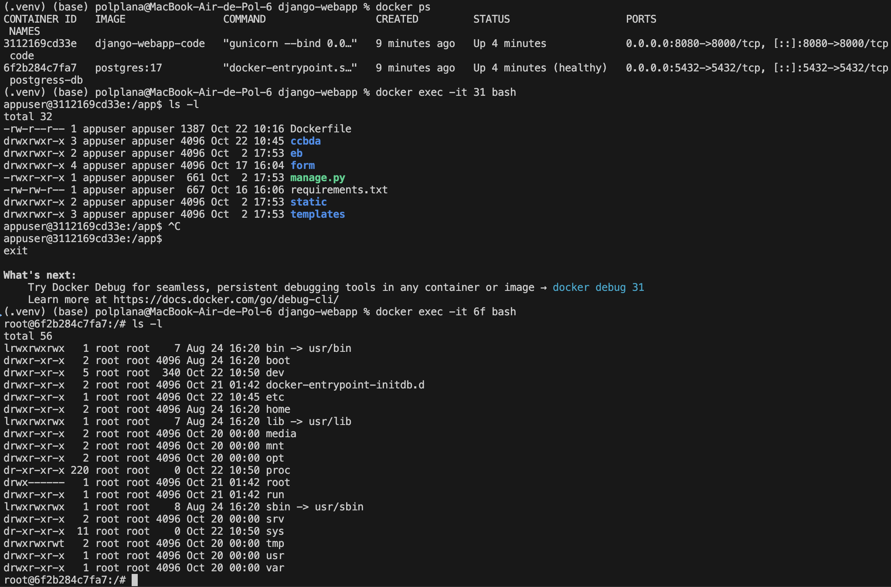

# 2026_1-4-19
## Team Members
- Mariam Delgado
- Pol Plana

## Task 4.3: Test the web app locally
### ❓ Question 1: Create a screen capture of your DynamoDB table with the data of the new leads. Add your thoughts on the above tasks.

The screenshot below shows the DynamoDB table ccbda-signup-table populated with two leads (two items using email as the partition key), created by submitting the newsletter form in the local Django app (http://127.0.0.1:8000/).

As we had created the table in us-east-1, we configured AWS CLI default profile to us-east-1. Then, we set up the project .env (making sure we had the proper .gitignore configuration). We also created and activated a fresh Python 3.13 virtualenv, installed requirements, ran migrations and started the dev server. Finally, we submitted two test sign-ups and confirmed items appeared in DynamoDB.

We think that it is important to use the least-privilege policy for the IAM created user, lab4_user (FullAccess to DynamoDB and AWS Simple Notification Service, as this are the only things to be used in this lab session). It was also important to check that we never commit .env (verified it’s gitignored). We say how if a certain policy is not activated, an AccessDenied errors occur, ensuring a proper permissions management.

## Task 4.4: Use AWS Simple Notification Service in your web app
### ❓ Question 2: Has everything gone alright? Share your thoughts on the task developed above.

Overall, the integration of AWS Simple Notification Service (SNS) into our web app went smoothly. We were able to set up the necessary configurations without problems and in a very straightforward and easy way. The process of publishing messages to the SNS topic from our Django app was straightforward, and we saw how simple it was to include a service that could take days of work if implemented from scratch. 

We confirmed that the messages were successfully delivered to the subscribed endpoints, as you can see in the screenshot below:

## Task 4.5: Configure Docker
### ❓ Question 3: Has everything gone alright? Share your thoughts on the task developed above.

Yes. The Docker image built successfully (see docker image list below), and the container ran with port binding 8080:8000 and the provided --env-file. The app was reachable at http://0.0.0.0:8080/, and logs confirmed normal Django startup plus successful operations: items added to DynamoDB and SNS messages sent.

## Task 4.6: Deploy the target web app
### ❓ Question 4: Share your thoughts on the task developed above.

The deployment task went very well. We successfully transitioned from a development-ready single container to a production-ready multi-container architecture using Docker Compose, which orchestrates both the Django app and PostgreSQL database with proper networking and volume persistence. The key improvement we implemented is that we switched from `python:3.13.2` to `python:3.13.2-slim`, reducing image size by more than 1GB. We also created `production.env` with `DATABASE=postgresql`, `DB_HOST=db` (container name), and PostgreSQL credentials, updated `requirements.txt` with `gunicorn` and `psycopg2-binary`, and configured `.dockerignore` to keep the image lean and secure.

## Task 4.7: Analisys of the twelve-factor app methodology
### ❓ Question 5: For the above lab session, explain, one by one, how each factor is taken into consideration, or what would you change or add to comply with each factor

## Submit Your Assignment
### ❓ Question 6: How much time did you spend on this session?

### ❓ Question 7: What challenges did you encounter, and how did you overcome them?

