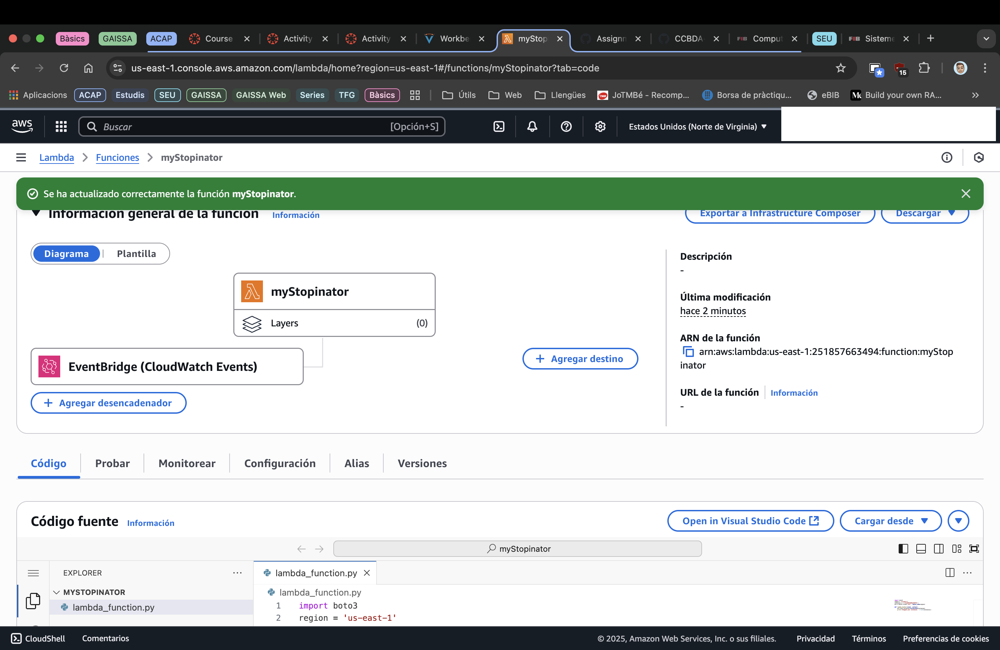
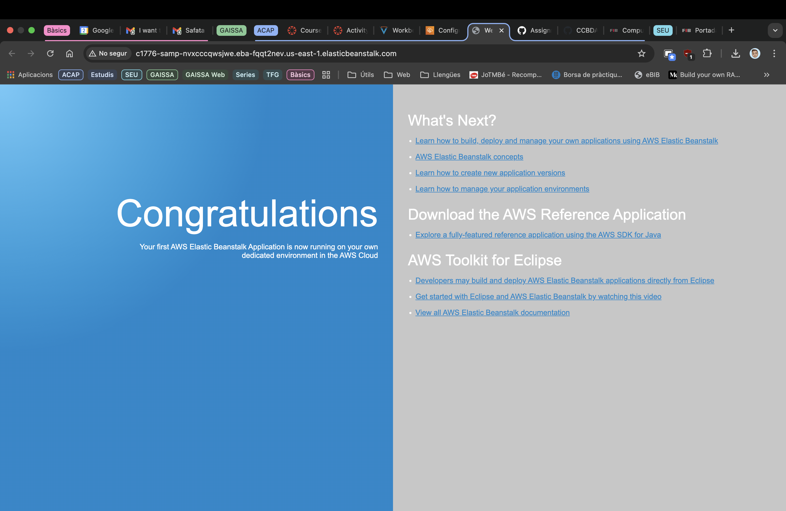

# 2026_1-2-20
## Team Members
- Zhehan Xiang
- Pol Plana

## Task 1: Deepen Your AWS Cloud Knowledge
### ❓ Question 1: Include screenshots of key steps and briefly explain what you learned or observed.
In this task, we continued our AWS course by completing the module 6, focused on computing services. We learned how to create and deploy an EC2 instance, a Lambda function, and an Elastic Beanstalk application.
We observed that AWS provides a wide range of computing services that can be used to deploy and manage applications in the cloud. We also learned about the different pricing models for these services, including on-demand, reserved, and spot instances.
The most challenging part of this task was to understand the different configurations and settings for each service. However, the step-by-step instructions provided in the module were very helpful in guiding us through the process. In particular, the fac this module not ony includes a lab and a quiz, but also two activities  that allow us to practice in a real AWS environment.

In previous modules, we had already created an EC2 instance, so we think he main advance in this one is on creating a Lambda function and an Elastic Beanstalk application.
In the image below, we can see the different steps we followed to create a Lambda function that runs a simple Python script. We also created an Elastic Beanstalk application that deploys a web application using a pre-configured environment.





### ❓ Question 2: Include screenshots of key steps and briefly explain what you learned or observed.

In this task, we learn that Amazon EBS provides persistent, network-attached block storage for Amazon EC2 instances. The lifetime of an EBS volume is independent of any particular instance, which allows us to detach and reattach it as needed. EBS volumes are designed for high availability and reliability, with data automatically replicated within a single Availability Zone to ensure durability and minimize failure risk. Their Annual Failure Rate (AFR) ranges between 0.1% and 1%. We also see that EBS can be used either as a boot volume—allowing instances to be stopped and restarted without losing data—or as additional block storage. Because EBS volumes are raw, unformatted block devices, we can format and use them with any operating system. Another key concept we explore is the use of snapshots. Snapshots provide point-in-time backups of EBS volumes and are stored in Amazon S3. They are automatically replicated across multiple Availability Zones, ensuring long-term durability while using space efficiently by copying only the used storage blocks. 

We learn to manage the full lifecycle of an EBS volume. We start by creating a 1 GiB General Purpose SSD (gp2) volume in the same Availability Zone as our target EC2 instance. Furthermore, we attach the new volume to the instance, connect to it via EC2 Instance Connect, and set it up on Linux. This includes creating an ext3 file system on the volume, mounting it to a directory such as /mnt/data-store, and configuring /etc/fstab so that it mounts automatically when the instance starts. To verify the setup, we add a test file named file.txt to the mounted volume. 

In the next stage, we focus on backup and restoration using snapshots. We create a snapshot of the EBS volume, then delete the file.txt file to simulate data loss. To recover the data, we create a new volume from the snapshot, which we can customize by changing its type, size, or Availability Zone. After attaching this restored volume to the instance and mounting it at a new location such as /mnt/data-store2, we verify that the file.txt file is still present, confirming that the snapshot successfully preserved our data. 


## Task 2: Getting Started with NLTK
### ❓ Question 3: Add your comments to `README.md
We ran `WordCountTensorFlow_1.py`, installed NLTK and downloaded the tokenizer. We also needed to download the input file `FirstContactWithTensorFlow.txt` in the project root.
Then, after reviewing the entire code to understand how it works, we added the total word count print in `main()` after tokenization:
````
total = len(tokens)
print(f"\nTotal number of words: {total}")
````
We considered that the total number of words is the length of the tokens list, because it contains all the words in the text after tokenization.

### ❓ Question 4: Add the code to WordCountTensorFlow_2.py and your comments to `README.md

After adding the code provided that removes punctuations, we observed that the result changed.

In [WordCountTensorFlow_1.py](WordCountTensorFlow/WordCountTensorFlow_1.py) the total number of words are 19593.

In [WordCountTensorFlow_2.py](WordCountTensorFlow/WordCountTensorFlow_2.py) the total number of words are 21661.

### ❓ Question 5: Why isn’t "TensorFlow" the most frequent word?
After running `WordCountTensorFlow_2.py`, we observed that "tensorflow" is not the most frequent word in the text. Instead, common words like "the", "and", and "to" appear more frequently.
```
First 10 tokens: ['first', 'contact', 'with', 'tensorflow', 'get', 'started', 'with', 'deep', 'learning', 'programming']
The 10 most common words are:
'the' appears 1445 times.
'of' appears 587 times.
'to' appears 532 times.
'in' appears 509 times.
'a' appears 496 times.
'and' appears 347 times.
'tf' appears 304 times.
'is' appears 289 times.
'we' appears 283 times.
'that' appears 276 times.
```

This is happening because the counting logic in the code does not filter out common stop words, so common stopwords and code tokens dominate. For example, words like the, of, to, etc. appear far more often than topical terms.

### ❓ Question 6: Which are the Stop Words?

From the previous question, we can observe that words such as “the,” “of,” “to,” “in,” “a,” “and,” “is,” “we,” “that,” and “tf” occur frequently but carry little meaningful information. These are considered stop words, as they do not contribute significantly to the overall understanding or analysis of the text.

### ❓ Question 7: Add the code to WordCountTensorFlow_3.py and your comments to `README.md
What changed from WordCountTensorFlow_2.py to WordCountTensorFlow_3.py:
- v2: counted raw tokens including common function words, so results were dominated by uninformative words.
- v3: removes English stop words before counting, showing more meaningful terms. Also prints the total token count after stopword removal.

In particular, we added the following code to remove stop words:
- Import and download the stopwords list from NLTK:
```
from nltk.corpus import stopwords
nltk.download('stopwords') 
```

- After tokenization, in the main function, we filter out stop words:
```
# Remove stopwords and show the 10 most common words again
sw = stopwords.words('english')
filtered = [w for w in tokens if not w in sw]
count = Counter(filtered)
print("\nThe 10 most common words after removing stopwords are:")
for word, freq in count.most_common(10):
    print(f"'{word}' appears {freq} times.")
```

## Task 3: Using the BlueSky API in Python
### ❓ Question 8: Did the data print correctly?

Yes, this is the output:
```
INFO:httpx:HTTP Request: POST https://bsky.social/xrpc/com.atproto.server.createSession "HTTP/1.1 200 OK"
INFO:httpx:HTTP Request: GET https://pholiota.us-west.host.bsky.network/xrpc/app.bsky.actor.getProfile?actor=zhehan02.bsky.social "HTTP/1.1 200 OK"
INFO:__main__:Login successful. Welcome, !
INFO:httpx:HTTP Request: POST https://pholiota.us-west.host.bsky.network/xrpc/com.atproto.repo.createRecord "HTTP/1.1 200 OK"
INFO:__main__:Post sent successfully: at://did:plc:r5jq6sggdoy6v6q5mnusu3zf/app.bsky.feed.post/3m27uhiwqot2e
INFO:httpx:HTTP Request: POST https://pholiota.us-west.host.bsky.network/xrpc/com.atproto.repo.createRecord "HTTP/1.1 200 OK"
INFO:__main__:Post liked successfully: at://did:plc:r5jq6sggdoy6v6q5mnusu3zf/app.bsky.feed.post/3m27uhiwqot2e
```
### ❓ Question 9: Add the code to BlueSky_2.py and your comments to `README.md
While BlueSky_1.py posted a message and liked it, BlueSky_2.py lists an actor’s feed with cursor-based pagination. Both use ATP_EMAIL and ATP_PASSWORD to login, but BlueSky_2.py also uses BLUESKY_USER to pick whose posts to list.

```
# v1: create a post, then like it
from atproto import client_utils

def create_and_post_text(client):
    text = client_utils.TextBuilder().text("Hello World from ").link("Python SDK", "https://atproto.blue")
    post = client.send_post(text)
    return post

def like_post(client, post):
    client.like(post.uri, post.cid)
```

```
# v2: list all posts from a handle with pagination
def list_all_posts(client, handle):
    cursor = ""
    i = 1
    while True:
        feed = client.get_author_feed(actor=handle, limit=100, cursor=cursor)
        cursor = feed.cursor
        for item in feed.feed:
            print(f"{i}: {item.post.record.created_at} -> {item.post.record.text}")
            i += 1
        if cursor is None:
            break
```

## Task 4: Posts pre-processing
### ❓ Question 10: Add the code to BlueSky_3.py and your comments to README.md.

We have change the proviuos code so that it only extract 10 post and apply the code porvided.

After executing [BlueSky_3.py](BlueSky/BlueSky_3.py), we can observe that "@", "#" and "emotions" are tokenized correctly. 

Outout of BlueSky_3.py:
```
INFO:httpx:HTTP Request: POST https://bsky.social/xrpc/com.atproto.server.createSession "HTTP/1.1 200 OK"
INFO:httpx:HTTP Request: GET https://pholiota.us-west.host.bsky.network/xrpc/app.bsky.actor.getProfile?actor=zhehan02.bsky.social "HTTP/1.1 200 OK"
INFO:__main__:Login successful. Welcome, !
INFO:httpx:HTTP Request: GET https://pholiota.us-west.host.bsky.network/xrpc/app.bsky.feed.getAuthorFeed?actor=upc.edu&cursor=&includePins=false&limit=10 "HTTP/1.1 200 OK"
['👍', 'Distinci', 'ó', 'Jaume', 'Vicens', 'Vives', 'a', 'la', 'professora', 'de', 'la', '@upctelecos', '.', 'bsky', '.', 'social', 'Eva', 'Vidal', 'i', 'al', 'projecte', '‘', 'InnoCrowd', '’', ',', 'de', 'la', '@upcvilanova', '.', 'upc', '.', 'edu', '.', 'Els', 'guardons', 'es', 'lliuraran', 'el', '7', 'd', '’', 'octubre', 'en', 'el', 'marc', 'la', 'inauguraci', 'ó', 'oficial', 'del', 'curs', 'acad', 'èmic', 'del', 'sistema', 'universitari', 'catal', 'à', '.', 'www', '.', 'upc', '.', 'edu', '/', 'ca', '/', 'sala-de-p', '.', '.', '.', 'El', 'Canal', 'Terrassa', "s'ha", 'fet', 'ress', 'ó', 'del', 'primer', 'simposi', 'sobre', 'propulsi', 'ó', 'a', "l'aviaci", 'ó', 'amb', 'energies', 'renovables', 'que', 'vàrem', 'celebrar', 'ahir', 'a', "l'ESEIAAT", 'de', 'la', '@upc', '.', 'edu', 'organitzat', 'pel', 'nostre', 'professor', '@frikosal', '.', 'bsky', '.', 'social', 'Veieu', 'la', 'video', 'noticia', 'aqu', 'í', '👇', 'youtu', '.', 'be', '/', 'YrblHWPw', '_0k', '?', '.', '.', '.', 'Surten', 'de', 'la', 'universitat', 'els', 'primers', 'graduats', 'en', '#IA', ':', '"', 'Les', 'empreses', 'ens', 'busquen', '"', '@fib', '.', 'upc', '.', 'edu', '#ArtificialIntelligence', 'www', '.', '3', 'cat', '.', 'cat', '/', '3', 'catinfo', '/', 'sur', '.', '.', '.', 'El', 'Grup', "d'Hidrologia", 'Subterr', 'ània', '(', 'GHS', ')', 'de', 'la', '@upc', '.', 'edu', 'participa', 'en', 'el', 'projecte', '#LIFEREMAR', '.', 'L', '’', 'objectiu', 'és', 'desenvolupar', 'una', 'soluci', 'ó', 'innovadora', 'i', 'sostenible', 'per', 'reutilitzar', 'aig', 'ües', 'residuals', 'tractades', 'mitjan', 'çant', 'infiltraci', 'ó', '.', '#EDAR', '#Cambrils', 'IDAEA', '-', '@csic', '.', 'es', '@cnrs', '.', 'fr', '@rdi', '.', 'upc', '.', 'edu', '🔗', 'https://bit.ly/4pMWFogLa', 'catedr', 'àtica', '#UPC', 'Karina', 'Gibert', ',', 'Medalla', "d'Honor", 'del', 'Parlament', 'de', 'Catalunya', '✅', 'La', 'professora', 'de', 'la', '@fib', '.', 'upc', '.', 'edu', ',', 'cofundadora', 'de', "l'IDEAI-UPC", 'i', 'experta', 'en', 'intel', '·', 'lig', 'ència', 'artificial', 'rep', 'el', 'reconeixement', '"', 'la', 'seva', 'aportaci', 'ó', 'a', 'la', 'governan', 'ça', 'de', 'la', 'intel', '·', 'lig', 'ència', 'artificial', '.', 'www', '.', 'upc', '.', 'edu', '/', 'ca', '/', 'sala-de-p', '.', '.', '.', 'És', 'viable', 'l', '’', 'energia', 'renovable', 'a', 'l', '’', 'aviaci', 'ó', 'comercial', '?', 'I', 'l', '’', 'hidrogen', '?', 'Què', 'són', 'els', 'combustibles', 'd', '’', 'aviaci', 'ó', 'sostenibles', '(', 'SAF', ')', '?', 'Aquestes', 'i', 'altres', 'qüestions', 'es', 'debatran', 'al', 'simposi', 'sobre', 'propulsi', 'ó', 'a', "l'aviaci", 'ó', 'amb', 'energies', 'renovables', ',', 'l', "'", '1', 'd', '’', 'octubre', ',', 'a', 'l', '’', '@eseiaat', '-', 'upc', '.', 'bsky', '.', 'social', '.', 'www', '.', 'upc', '.', 'edu', '/', 'ca', '/', 'sala-de-p', '.', '.', '.', 'Les', 'investigadores', 'Maria', 'Pau', 'Ginebra', 'i', 'Jezabel', 'Curbelo', 'i', 'l', '’', 'investigador', 'Sergi', 'Abadal', ',', 'guardonats', 'amb', 'els', 'Premis', 'Nacionals', "d'Investigaci", 'ó', '2025', '.', 'Enhorabona', '!', '👏', '@eebe', '.', 'upc', '.', 'edu', '@ccem', '-', 'upc', '.', 'bsky', '.', 'social', '@upctelecos', '.', 'bsky', '.', 'social', '@mat', '.', 'upc', '.', 'edu', '@fme', '.', 'upc', '.', 'edu', 'www', '.', 'upc', '.', 'edu', '/', 'ca', '/', 'sala-de-p', '.', '.', '.', 'L', '’', 'Ajuntament', 'de', 'Manresa', 'aprova', 'les', 'bases', 'per', 'al', 'concurs', 'del', 'projecte', 'd', '’', 'interiors', 'de', 'la', 'Fàbrica', 'Nova', '.', 'Un', 'nou', 'pas', 'per', 'definir', 'els', 'espais', 'i', 'els', 'usos', 'de', 'l', '’', 'antic', 'recinte', ',', 'que', 'esdevindr', 'à', 'pol', 'de', 'formaci', 'ó', ',', 'recerca', ',', 'emprenedoria', 'i', 'innovaci', 'ó', 'de', 'la', 'mà', 'de', 'la', '#UPC', '@manresa', '.', 'upc', '.', 'edu', 'www', '.', 'upc', '.', 'edu', '/', 'ca', '/', 'sala-de-p', '.', '.', '.', '💫', 'El', 'poder', 'de', 'la', 'imaginaci', 'ó', 'protagonitza', 'la', 'inauguraci', 'ó', 'del', 'curs', 'acad', 'èmic', '2025', '-', '2026', 'a', 'la', '#UPC', '💫', 'En', 'un', 'acte', 'que', 'ha', 'recreat', 'l', '’', 'univers', 'de', 'Hogwarts', ',', 'l', '’', 'escola', 'de', 'màgia', 'de', 'la', 'saga', 'Harry', 'Potter', ',', 'a', 'la', 'sala', 'd', '’', 'actes', 'de', 'l', '’', '@eseiaat', '-', 'upc', '.', 'bsky', '.', 'social', '.', '🔗', 'www', '.', 'upc', '.', 'edu', '/', 'ca', '/', 'sala-de-p', '.', '.', '.', '💫', 'Avui', ',', 'inaugurem', 'oficialment', 'el', 'curs', '2025', '-', '2026', '!', 'A', 'les', '12', 'h', ',', 'a', 'l', "'", '@eseiaat', '-', 'upc', '.', 'bsky', '.', 'social', ',', 'amb', 'un', 'acte', 'que', 'posar', 'à', "l'accent", 'en', 'el', 'poder', 'de', 'la', 'imaginaci', 'ó', 'com', 'a', 'motor', 'de', 'la', 'innovaci', 'ó', 'i', 'del', 'futur', 'STEAM', '.', 'En', 'directe', 'a', 'YouTube', ':', 'www', '.', 'youtube', '.', 'com', '/', 'live', '/', '5', 'hmgevN', '.', '.', '.']
```

## Submit Your Assignment
### ❓ Question 11: How much time did you spend on this session?
To complete the activities in this lab, we dedicated roughly 4 hours in total. This time was mainly split between exploring AWS Cloud services (the AWS Academy modules 6 and 7 took about two hours), gaining a deeper understanding of the Python code implementation, and writing the required answers and documentation for the assignment.

### ❓ Question 12: What challenges did you encounter, and how did you overcome them?


