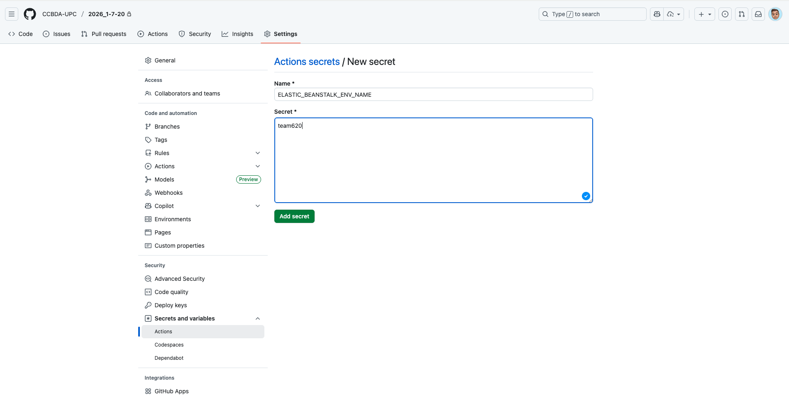
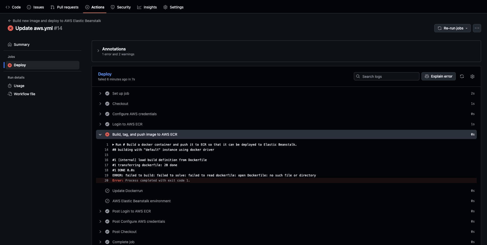
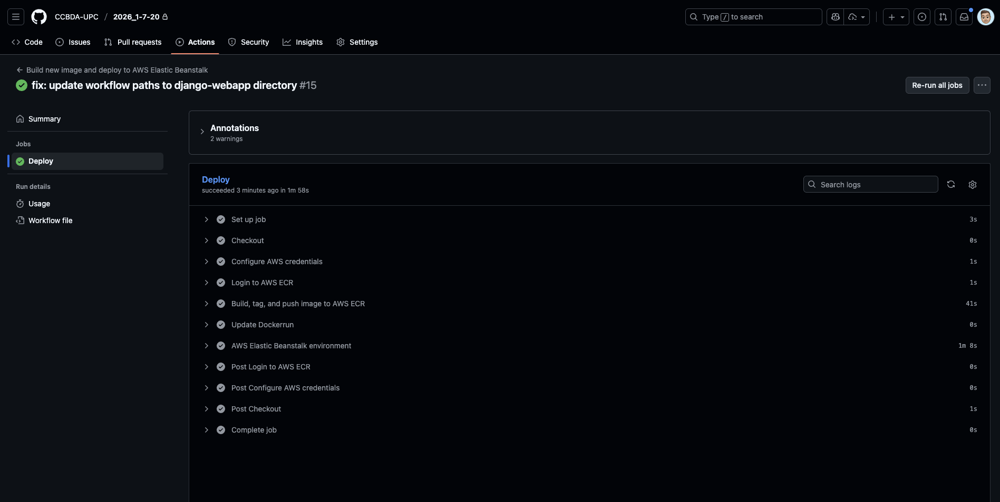

# 2026_1-7-20
## Team Members
- Pau Campillo
- Pol Plana

## Task 7.1: CI/CD build using GitHub Actions
### ❓ Question 1: Create an administrative Python script to have the AWS Elasticbeanstalk environment of the previous session up and running.

> We created an administrative Python script called `setup_eb_environment.py` located in `django-webapp/.housekeeping/scripts/`. This script automates the entire process of setting up and deploying the Django web application to AWS Elastic Beanstalk.
>
> **Script:**
> 1. Verifies that Docker, AWS CLI, and EB CLI are installed
> 2. Reads environment variables from the `.env` file using `python-dotenv`
> 3. Builds the Docker image with `--platform linux/amd64` flag for AWS EC2 compatibility (important for Apple Silicon Macs)
> 4. Authenticates Docker with AWS Elastic Container Registry
> 5. Tags and pushes the Docker image to ECR
> 6. Updates the configuration file with the new image URI
> 7. Deploys to Elastic Beanstalk or provides the `eb create` command if the environment doesn't exist
> 8. Checks the environment status and health
>
> **Usage:**
> ```bash
> cd django-webapp/.housekeeping/scripts
> python setup_eb_environment.py ../../aws.env team620 v1.0.3
> ```
>

---

### ❓ Question 2: Describe what you've seen in the AWS Elasticbeanstalk and EC2 consoles: logs, number of instances running,etc. Anything that you consider meaningful and provide your explanation and thoughts.

> **AWS Elastic Beanstalk Console Observations:**
> - **Environment Status**: The environment `team620` shows as "Ready" with health status "Green" after successful deployment
> - **Application Versions**: In this menu, we can see multiple application versions stored, allowing rollback if needed
> - **Events Events Section**: Shows the complete deployment timeline events
>
> **AWS EC2 Console Observations:**
> - **Running Instances**: 1 instance running (as per `--min-instances 1` configuration), as the application is not under heavy load
> - **Instance Type**: t3.micro
> - **Auto Scaling Group**: Configured with min=1, max=3 instances for automatic scaling based on load
>
> **What we found interesting:** The CI/CD pipeline successfully builds and deploys new versions without manual intervention!
>

---

### ❓ Question 3: Have you been able to execute the action? Share your thoughts about the complete action.

> **Yes, we successfully executed the GitHub Actions workflow after fixing an initial issue.**
>
> **Initial Problem:**
> The first deployment attempt failed with the error:
> ```
> ERROR: failed to build: failed to solve: failed to read dockerfile: open Dockerfile: no such file or directory
> ```
>
> This occurred because the workflow was looking for the `Dockerfile` in the repository root, but it's located inside the `django-webapp/` directory.
>
> **Solution:**
> We updated the `aws.yml` workflow file to:
> 1. Change into `django-webapp` directory before building: `cd django-webapp`
> 2. Update all paths to include `django-webapp/` prefix for `Dockerrun.aws.json`
>
> **Screenshots:**
>
> Setting up GitHub Secrets:
> 
>
> Failed deployment (before fix):
> 
>
> Successful deployment (after fix):
> 
>
> **Thoughts on the Complete CI/CD Action:**
> - The workflow completely automates the build-tag-push-deploy cycle, eliminating manual steps
> - Using git tags (e.g., `v1.1.2`) as triggers ensures proper versioning and traceability
> - Each version creates a new Docker image in ECR, enabling easy rollbacks
> - Sensitive credentials are stored as GitHub Secrets, not in the codebase


---

### ❓ Question 4: What does the above script do and how can you use it?

>

---

## Task 7.2: Observability using AWS CloudWatch, Elastic and Kibana
### ❓ Question 5: Play with AWS CloudWatch and the logs that you have obtained. Share your insights.

>

---

### ❓ Question 6: Play with Kibana and the logs that you have obtained. Share your insights.

>

---

## How to submit this assignment:
### ❓ Question 7: Assess the current version of the web application against each of the twelve factor application.

>

---

### ❓ Question 8: How long have you been working on this session? What have been the main difficulties that you have faced and how have you solved them? Add your answers to README.md.

>

---

### ❓ Question 9: Using the AWS Billing and Cost Management Service, access the "Cost Explorer" and capture the cost of last week Using the "Dimension" "Service" where you can see how much did you spend to complete the session in total and per service.

>

---