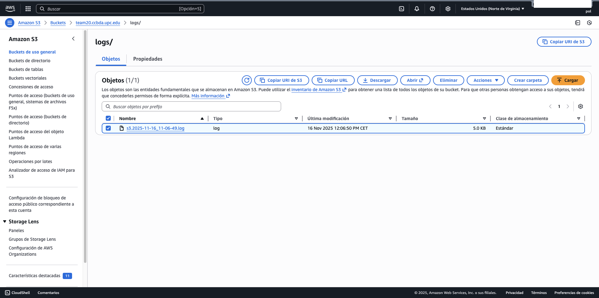
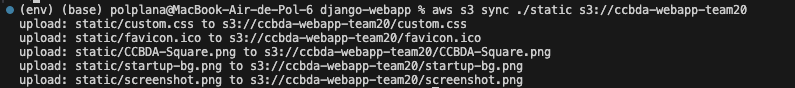
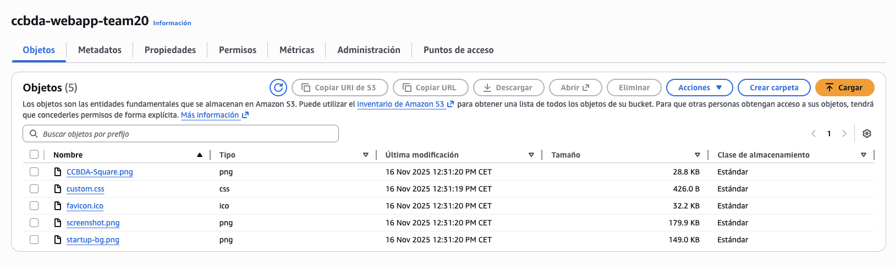
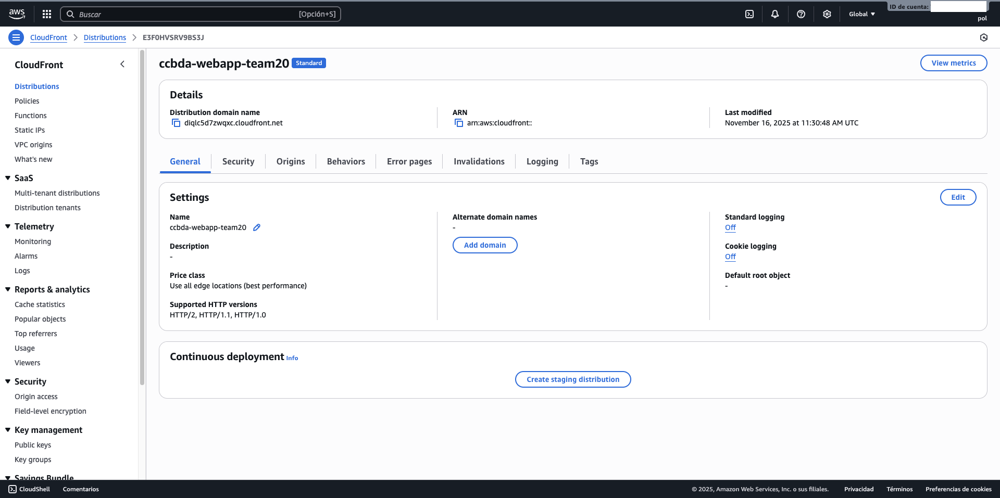
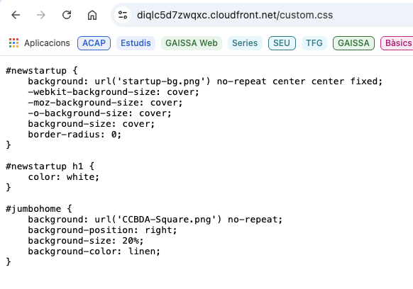
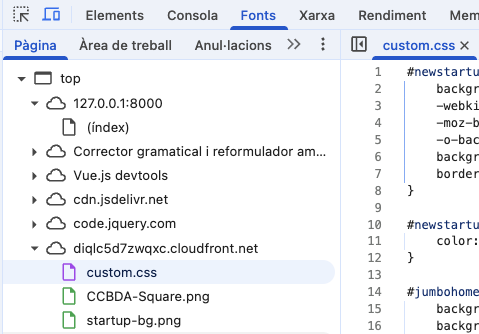
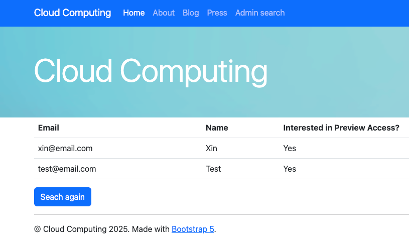
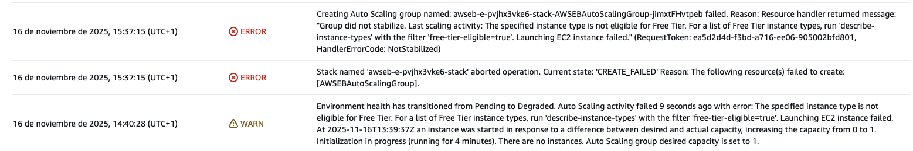
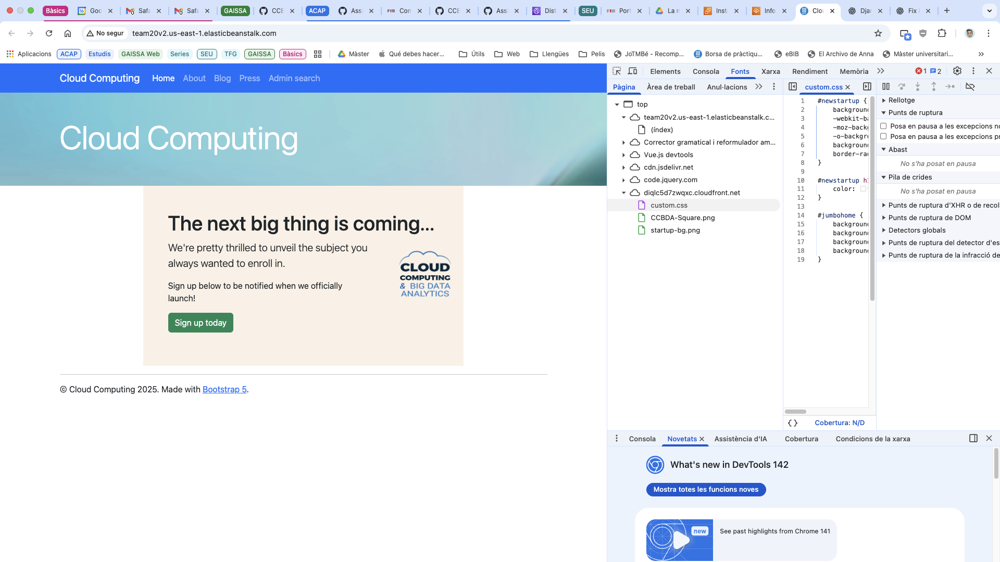
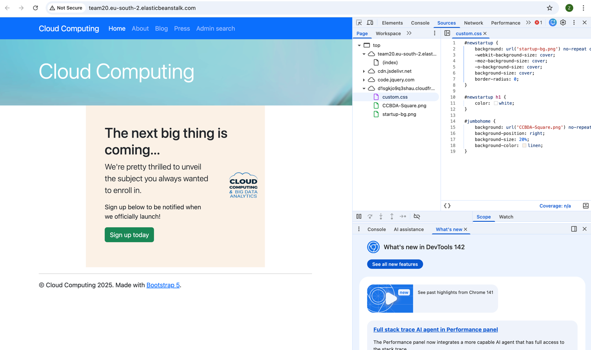

# 2026_1-6-20
## Team Members
- Zixin Zhang
- Pol Plana

## Task 6.1: Centralize the logs of your application instances
### ❓ Question 1: What issues have you met when following the above instructions?
> The main issue we encountered was that the log files were not being uploaded to the S3 bucket immediately when running the web application locally. Initially, we expected to see logs appearing in the S3 bucket as soon as we started generating log entries through the application. However, after reviewing the logging configuration in `settings.py`, we discovered that the `maxBytes` parameter was set to 5 KB (`5 * 1024` bytes). This means that the log file must reach at least 5 KB in size before the log rotation mechanism triggers and uploads the file to S3. Once we understood this behavior, we were able to verify the functionality by generating enough log entries to exceed the threshold.

---

### ❓ Question 2: Run the web application locally and play with the log size of the s3 handler and see how the bucket keeps receiving log files. Share your thoughts. When you run the web application can you see the logs where you expected?
> After understanding the 5 KB minimum file size requirement, we tested the logging functionality by repeatedly submitting the signup form to generate log entries. Each signup creates multiple log messages, which helped us quickly reach the 5 KB threshold. Once the log file exceeded this size, the `S3RotatingFileHandler` automatically performed the rollover operation: it renamed the current log file with a timestamp (e.g., `s3.2025-11-16_11-06-49.log`), uploaded it to the S3 bucket under the `logs/` prefix, and created a new empty `s3.log` file to continue logging. 
>
> The logs appeared exactly where we expected them in the S3 bucket: `s3://team20.ccbda.upc.edu/logs/`. This centralized logging approach is very effective for production environments where multiple EC2 instances need to send logs to a common location for monitoring and analysis. The rotation mechanism ensures that log files don't grow indefinitely while maintaining a complete history in S3. The verbose log format with instance ID, module, and line numbers makes it easy to debug issues and trace activity across different instances.



---

## Task 6.2: Deliver static content using a Content Delivery Network
### ❓ Question 3: Take a couple of screenshots of you S3 and CloudFront consoles to demonstrate that everything worked all right.
>
>










---

## Task 6.3: Create a new option to retrieve the list of leads


### ❓ Question 4: Has everything gone alright? What have you changed to make it work in the cloud using Elasticbeanstalk?
> The deployment to AWS Elastic Beanstalk faced several challenges that required specific solutions:
>
> **1. Docker Platform Architecture Issues (Apple Silicon M-series Macs)**
> - **Problem**: Initially built the new Docker images on Apple Silicon (ARM architecture) failed to run on AWS EC2 instances (x86_64 architecture)
> - **Solution**: Fllowing the same issue we found inthe previous laboratory session, we rebuilt the Docker image using the `--platform linux/amd64` flag to ensure x86_64 compatibility:
>   ```bash
>   docker build --platform linux/amd64 -t django-docker:v1.0.2.1 .
>   ```
>
> **2. Instance Type Selection**
> - **Problem**: We tried an initial deployment with `t3.nano` which failed because they are not eligible for AWS Free Tier
> - **Solution**: Changed the instance type to `t3.small`, a configuration that worked correctly in the previous laboratory session



>
> **3. Shell Special Characters in Environment Variables**
> - **Problem**: Passwords containing `!` characters caused zsh history expansion errors during command execution
> - **Solution**: Used single quotes instead of double quotes when passing the `--envvars` parameter to prevent shell interpretation of special characters
>
>
> The application successfully deployed and is running with full functionality including DynamoDB search, S3 logging, CloudFront CDN, RDS PostgreSQL, and SNS notifications. You can see below a screenshot of the deployed application running in AWS Elastic Beanstalk, showing the use of the CDN in the source of the corresponding static files.



---

### ❓ Question 5: Explain all the steps that you have followed after changing the web application code to have the web application updates running in the cloud.
> After implementing the search functionality (Task 6.3) in our web application, we followed these steps to deploy the updates to AWS Elastic Beanstalk:
>
> **Step 1: Test Locally**
> - First, we tested all changes locally using `python manage.py runserver`
> - Verified the search functionality works at `http://127.0.0.1:8000/search`
> - Confirmed the new menu item appears in the navigation bar
> - Tested different search scenarios (domain filter, preview filter, and no filters)
>
> **Step 2: Rebuild Docker Image with New Version**
> ```bash
> # Build new Docker image with updated code
> docker build -t django-docker:v1.0.2.1 .
> 
> # Tag the image for AWS ECR
> docker tag django-docker:v1.0.2.1 <aws-registry-id>.dkr.ecr.<aws-region>.amazonaws.com/django-webapp-docker-repo:v1.0.2.1
> ```
> 
> **⚠️ Important for Apple Silicon (M1/M2/M3) Macs:**
> If you're using a Mac with ARM architecture (M-series chips), you **must** build the Docker image for the `linux/amd64` platform, as AWS EC2 instances use x86_64 architecture:
> ```bash
> # Build for x86_64 architecture (required for AWS deployment)
> docker build --platform linux/amd64 -t django-docker:v1.0.2.1 .
> 
> # Tag the image for AWS ECR
> docker tag django-docker:v1.0.2.1 <aws-registry-id>.dkr.ecr.<aws-region>.amazonaws.com/django-webapp-docker-repo:v1.0.2.1
> ```
> Without the `--platform linux/amd64` flag, your ARM-based Docker image will fail to run on AWS EC2 instances with errors like "exec format error" or container crashes.
>
> **Step 3: Authenticate with AWS ECR**
> ```bash
> # Get login password and authenticate Docker with ECR
> aws ecr get-login-password --region <aws-region> | docker login --username AWS --password-stdin <aws-registry-id>.dkr.ecr.us-east-1.amazonaws.com
> ```
>
> **Step 4: Push New Image to AWS ECR**
> ```bash
> # Push the new version to ECR repository
> docker push <aws-registry-id>.dkr.ecr.<aws-region>.amazonaws.com/django-webapp-docker-repo:v1.0.2.1
> 
> # Verify the image was uploaded
> aws ecr list-images --repository-name django-webapp-docker-repo
> ```
>
> **Step 5: Update Dockerrun.aws.json**
> - Navigate to `.housekeeping/elasticbeanstalk/` directory
> - Update `Dockerrun.aws.json` to reference the new image version:
> ```json
> {
>   "AWSEBDockerrunVersion": "1",
>   "Image": {
>     "Name": "<aws-registry-id>.dkr.ecr.<aws-region>.amazonaws.com/django-webapp-docker-repo:v1.0.2.1"
>   },
>   "Ports": [
>     {
>       "ContainerPort": 8000
>     }
>   ]
> }
> ```
>
> **Step 6: Initialize and Create Elastic Beanstalk Environment**
> 
> If this is your first deployment, you need to initialize and create the EB environment:
> 
> ```bash
> cd .housekeeping/elasticbeanstalk
> 
> # Initialize Elastic Beanstalk application
> eb init --region <aws-region> -i django-webapp-eb
> # Select: Docker -> Docker running on 64bit Amazon Linux 2023 -> SSH: yes -> Select keypair
> 
> # Generate the create command using the Python script
> cd .houskeeping/elasticbeanstalk/
> python ../scripts/ebcreate.py ../../aws.env team20
> 
> # Copy and run the output command (it will be very long)
> # Example: eb create team20 --min-instances 1 --max-instances 3 ...
> ```
> 
> If the environment already exists, use these commands instead:
> 
> ```bash
> # List existing environments
> eb list
> 
> # Select your environment
> eb use team20
> 
> # Deploy the new version
> eb deploy
> ```
> 
> **Important Notes:**
> - The first `eb create` takes 5-15 minutes to provision all AWS resources
> - Subsequent deployments with `eb deploy` are much faster (2-5 minutes)
> - Make sure your IAM user has `AdministratorAccess-AWSElasticBeanstalk` policy
> - Ensure the `AmazonEC2ContainerRegistryReadOnly` and `AWSElasticBeanstalk` policies
>
> **Step 7: Monitor Deployment**
> - Watch the deployment progress in terminal
> - Check AWS Elastic Beanstalk console for health status
> - Wait for environment health to return to "Ok" (green)
> ```bash
> eb status  # Check deployment status
> eb health  # Monitor instance health
> ```
>
> **Step 8: Verify Deployment**
> ```bash
> # Open the web application in browser
> eb open
> ```
> - Test the search functionality at `/search`
> - Verify the Admin search menu item appears
> - Test filtering by domain and preview options
> - Check that data from DynamoDB is retrieved correctly
>
> **Step 9: Terminate Environment (if needed)**
> ```bash
> # Terminate the EB environment to avoid costs
> eb terminate team20
> ```

---

### ❓ Question 6: Draw a diagram of the current deployment of the web app using a tool such as Draw.io
>
>

---

### ❓ Question 7: Assess the current version of the web application against each of the twelve factor application.
>
>

---

## Wrap Up:
### ❓ Question 8: How long have you been working on this session? What have been the main difficulties that you have faced and how have you solved them? Add your answers to README.md.
> **Time Spent**: We spent 8 hours in total across implementation, testing, debugging, deployment, and question answering phases.
>
> **Main Difficulties and Solutions:**
>
> **1. S3 Log Rotation Behavior**
> - **Difficulty**: Logs weren't appearing in S3 immediately after starting the application
> - **Root Cause**: The `S3RotatingFileHandler` only uploads logs after reaching the 5 KB threshold
> - **Solution**: Generated sufficient log entries by repeatedly submitting the signup form to trigger rotation and verify the upload mechanism worked correctly
>
> **2. CloudFront CDN Integration**
> - **Difficulty**: Configuring `django-storages` to work with both S3 and CloudFront without breaking local development
>
> **3. DynamoDB Search Implementation Bug Solving**
> - **Difficulty**: Handling edge cases in search functionality, including:
>   * `None` returns from DynamoDB causing "NoneType is not iterable" errors
>   * Malformed email addresses without `@` symbol causing `IndexError`
>
> **4. Docker Multi-Architecture Build Issues**
> - **Difficulty**: Docker images built on Apple Silicon Mac (ARM) failed on AWS EC2 (x86_64) because ARM-based images are incompatible with AWS EC2's x86_64 architecture.
> - **Solution**: We rebuilt all Docker images with `--platform linux/amd64` flag to ensure cross-platform compatibility
>

---

### ❓ Question 9: Using the AWS Billing and Cost Management Service, access the "Cost Explorer" and capture the cost of last week Using the "Dimension" "Service" where you can see how much did you spend to complete the session in total and per service.
>
>

