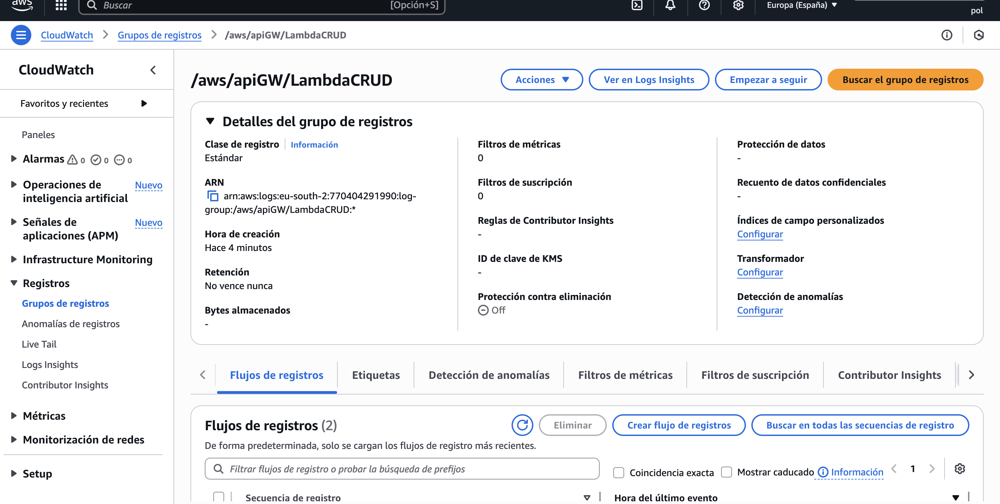
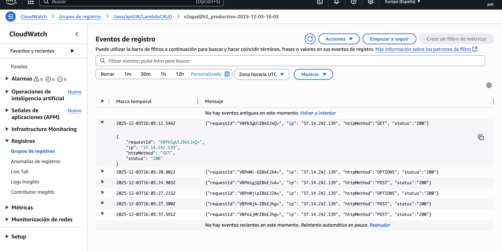

# 2026_1-8-18
## Team Members
- Ixent Cornella
- Pol Plana

## Task 8.1: Simple serverless web application using REST API

### ❓ Question 1: Explain why every REST API verb is managed by a single line such as return respond(dynamodb.put_item(**json.loads(event['body']))). Explicit the parameters sent inside the kwargs of the dynamodb.*() methods used in the code and compare them with the AWS documentation.

---

### ❓ Question 2: Assess the current version of the web application against each of the twelve factor application.

Factor | Assessment | Verdict |
| :--- | :--- | :--- |
| **1. Codebase** | All code (Lambda, HTML, scripts) is tracked in a single version control repository (the git zip/folder we obtained), and deployed to different environments (though you only deployed one). | **Passed** ✅ |
| **2. Dependencies** | Dependencies are explicitly declared in `requirements.txt`. The deployment script uses this file to package the application, ensuring the correct dependencies are used. | **Passed** ✅ |
| **3. Config** | Configuration is strictly separated from code. We initially store config in environment variables (`REGION`, `LOG_LEVEL`) injected into the Lambda environment at deployment time, and `variables.json` for the frontend. Later on the lab, we improve this by settign the necessary env file for the script to work.  | **Passed** ✅ |
| **4. Backing Services** | DynamoDB is treated as an attached resource. The app connects via an API endpoint (handled by Boto3 and AWS region), not a local file path. Swapping the database just requires changing the `TableName` or Region. | **Passed** ✅ |
| **5. Build, Release, Run** | The separation is strict.  1. **Build:** `zip` command creates the artifact. 2. **Release:** `aws lambda update-function-code` combines the build with config. 3. **Run:** AWS executes the function. | **Passed** ✅ |
| **6. Processes** | The app is stateless. The Lambda function executes and dies. No state is shared between requests in memory, everything persists in DynamoDB. | **Passed** ✅ |
| **7. Port Binding** | The app is self-contained. While the Lambda doesn't bind to a port manually, it exports its service via API Gateway (HTTP), effectively binding to the web. | **Partial / Mixed** ⚠️/✅ |
| **8. Concurrency** | Scaling is handled via the process model. Each request spawns a new Lambda execution environment. We don't manage threads, AWS scales the processes horizontally automatically. | **Passed** ✅ |
| **9. Disposability** | Lambda functions have fast startup and graceful shutdown. They are designed to handle immediate termination without data corruption (due to statelessness). | **Passed** ✅ |
| **10. Dev/Prod Parity** | We are deploying directly to the cloud, so "Dev" is technically "Prod" in this lab. However, using the `deploy.sh` script ensures that every deployment (whether for testing or production) is identical, minimizing divergence. | **Partial / Mixed** ⚠️/✅ |
| **11. Logs** | The application writes to `stdout`. AWS CloudWatch captures these streams automatically for analysis. | **Passed** ✅ |
| **12. Admin Processes** | Administrative tasks (like creating the database table) are run as one-off processes via the AWS CLI in the `deploy.sh` script, separate from the running application logic. | **Passed** ✅ |

---

### ❓ Question 3: Create a new shell script that removes all the assets that have been created.

>

---

### ❓ Question 4: Retouch deploy.sh to make the API Gateway produce logs into the log group named "/aws/apiGW/LambdaCRUD" of your account. Explain what you have done and show the log outcome.

We created a backup of the original `deploy.sh` in `deploy_original.sh` before making any changes.

> **WARNING:** In order to be able to complete the log group creation and access, we had to manually attach the **`CloudWatchLogsFullAccess`** policy to the `lab_serverless_user` IAM user. Without this, the script failed because the user lacked the `logs:CreateLogDelivery` permission required to authorize API Gateway to write to CloudWatch.

Then, we implemented these two key actions to satisfy the observability requirement:

1. **Created a dedicated Log Group:** We added the command `aws logs create-log-group` to explicitly create a log group named `/aws/apiGW/LambdaCRUD`.
2. **Configured Access Logs:** We modified the `aws apigatewayv2 create-stage` command to include the `--access-log-settings` parameter. This maps the API Gateway traffic to the new Log Group ARN and defines a specific JSON format to capture relevant details (Request ID, Source IP, HTTP Method, and Status Code).

We also implemented several changes in the script, as it was failing in some parts due to having already performed some of the steps. We added logic to check if resources (like the DynamoDB table or Lambda function) already exist and skip or update them instead of trying to create them again. This has turned the script suitable for already deployed environments, making it much more robust and suitable to our needs.

*Figure: CloudWatch showing the new /aws/apiGW/LambdaCRUD group has been created.*

*Figure: Inside the log group, showing the JSON access logs generated by API Gateway.*

---

### ❓ Question 5: Create a GitHub Action to deploy the changes in the Lambda function.

>

---

### ❓ Question 6: Share your thoughts about the web application.

>

---

## Task 8.2: Simple serverless web application using WebSockets
### ❓ Question 7: Go to one of the lambda functions and change the value of LOG_LEVEL from INFO to DEBUG in the "Configuration" tab "Environment variables" section. Do you need to redeploy the Lambda Function to have more details on the logs? Why?

>

---

### ❓ Question 8: Create GitHub actions to deploy the changes on the Lambda functions.

>

---

### ❓ Question 9: Assess the current version of the web application against each of the twelve factor application.

>

---

### ❓ Question 10: Provide screenshots of the significant AWS SQS metrics shown in the "Monitoring" tab.

>

---

### ❓ Question 11: Provide screenshots of the DynamoDB table used.

>

---

### ❓ Question 12: Share your thoughts about the web application.
>

---

## How to submit this assignment:
### ❓ Question 13: How long have you been working on this session? What have been the main difficulties that you have faced and how have you solved them? Add your answers to README.md.

>

---

### ❓ Question 14: Using the AWS Billing and Cost Management Service, access the "Cost Explorer" and capture the cost of last week Using the "Dimension" "Service" where you can see how much you did spend to complete the session in total and per service.

>

---
