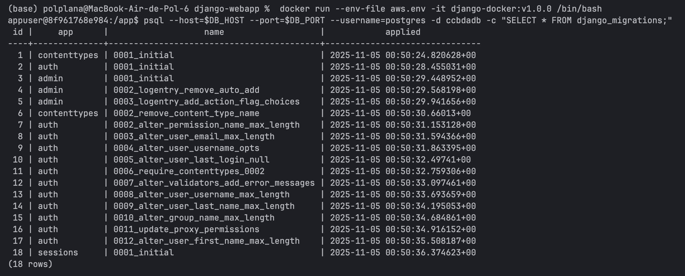

# 2026_1-5-15
## Team Members
- Álvaro Rodríguez
- Pol Plana

# Task 5.1: AWS Relational Database Service
## ❓ Question 1: Explain why you will not keep that access open on a production system. How can you do manual maintenance on the database using SQL commands, when necessary?

We should not keep public access open on a production database for several security reasons:

1. **Security Risk**: Opening the database to public internet access (0.0.0.0/0) exposes it to potential attacks, brute force attempts, and unauthorized access from anywhere in the world.

2. **Attack Surface**: Every publicly accessible service increases the attack surface of our infrastructure, making it vulnerable to SQL injection attacks, DDoS attacks, and other malicious activities.

**How to do manual maintenance when necessary:** Set up a VPN connection to the AWS VPC and access the database through the private network.

## ❓ Question 2: Using the above configuration file, what steps will you follow to have the web application running in your local Docker use the AWS RDS database engine?

To run the web application in local Docker using the AWS RDS database engine, we followed these steps:

1. **Build the Docker image** with a version tag:
   ```bash
   docker build -t django-docker:v1.0.0 .
   ```

2. **Ensured the `aws.env` file is properly configured** with the AWS RDS connection details.

3. **Verified RDS security group** allows inbound traffic on port 5432 from our laptop's IP address.

4. **Initialize the database** (first time only) by running the container interactively:
   ```bash
   docker run --env-file aws.env -it django-docker:v1.0.0 /bin/bash
   ```
   Then inside the container, create the database and user:
   ```bash
   cat > init_db.sql << 'EOF'
    CREATE DATABASE ccbdadb;
    CREATE USER ccbdauser
        WITH ENCRYPTED PASSWORD 'ccbdapassword'
        createdb
        createrole
        bypassrls;
    ALTER USER ccbdauser SET TimeZone = utc;
    ALTER DATABASE ccbdadb OWNER TO ccbdauser;
    EOF
   ```
   
    ```bash
   psql --host=$DB_HOST --port=$DB_PORT --username=postgres < init_db.sql
    ```

   Where `init_db.sql` contains the SQL commands to create the database and user.

5. **Run Django migrations** to create the necessary tables in the RDS database:
   ```bash
   python manage.py migrate
   ```

6. **Started the Docker container** with the web application:
   ```bash
   docker run --env-file aws.env -p 8000:8000 django-docker:v1.0.0
   ```

7. **Access the web application** at `http://localhost:8000`

## ❓ Question 3: Explain what does the code in the box above. How can you execute it inside the Docker container?

The code in the box above performs the following operations to initialize the PostgreSQL database on AWS RDS:

1. **CREATE DATABASE ccbdadb;** - Creates a new database named `ccbdadb` that will store all the Django application data.

2. **CREATE USER ccbdauser WITH ENCRYPTED PASSWORD 'ccbdapassword' createdb createrole bypassrls;** - Creates a new PostgreSQL user `ccbdauser` with:
   - An encrypted password `ccbdapassword`
   - `createdb` privilege: allows the user to create new databases
   - `createrole` privilege: allows the user to create new roles/users
   - `bypassrls` privilege: allows the user to bypass row-level security policies

3. **ALTER USER ccbdauser SET TimeZone = utc;** - Sets the default timezone for the user to UTC to ensure consistent timestamp handling across the application.

4. **ALTER DATABASE ccbdadb OWNER TO ccbdauser;** - Changes the ownership of the `ccbdadb` database to `ccbdauser`, giving this user full control over the database.

**How to execute it inside the Docker container:**

1. First, enter the Docker container interactively:
   ```bash
   docker run --env-file aws.env -it django-docker:v1.0.0 /bin/bash
   ```

2. Inside the container, create the SQL script file using `cat` with input redirection:
   ```bash
   cat > init_db.sql << 'EOF'
    CREATE DATABASE ccbdadb;
    CREATE USER ccbdauser
        WITH ENCRYPTED PASSWORD 'ccbdapassword'
        createdb
        createrole
        bypassrls;
    ALTER USER ccbdauser SET TimeZone = utc;
    ALTER DATABASE ccbdadb OWNER TO ccbdauser;
    EOF
   ```

3. Execute the SQL script using the `psql` command:
   ```bash
   psql --host=$DB_HOST --port=$DB_PORT --username=postgres < init_db.sql
   ```
   
   The environment variables `$DB_HOST`, `$DB_PORT`, and `$PGPASSWORD` are automatically loaded from the `aws.env` file, which is why `psql` can authenticate and connect to the AWS RDS instance.

## ❓ Question 4: What is the result of "select * FROM django_migrations;"

The result of `SELECT * FROM django_migrations;` shows all the migrations that Django has applied to the database. After running `python manage.py migrate`, the table contains records of all applied migrations.

To execute this query inside the Docker container:

```bash
docker run --env-file aws.env -it django-docker:v1.0.0 /bin/bash
psql --host=$DB_HOST --port=$DB_PORT --username=postgres -d ccbdadb -c "SELECT * FROM django_migrations;"
```

The  output includes migrations from Django's built-in app:



Each row in the `django_migrations` table contains:
- `id`: Auto-incrementing primary key
- `app`: The Django app name (e.g., 'auth', 'admin', 'contenttypes', 'sessions')
- `name`: The migration filename (e.g., '0001_initial')
- `applied`: Timestamp when the migration was applied

This table is Django's way of tracking which database schema changes have been applied, ensuring that migrations are only run once and in the correct order. It prevents duplicate migrations and helps maintain database schema consistency across different environments.


# Task 5.3: Running Docker Container images on AWS Elastic Beanstalk
## ❓ Question 5. What have you found on the zip file? Why do you think it is like that?.

## ❓ Question 6. Open the AWS EC2 console and check how many instances are running and how many AWS ELB instances. Share your thoughts.

## ❓ Question 7. Terminate one of the AWS EC2 instances using the AWS EC2 console. Is the web app responding now? Why?

## ❓ Question 8. Wait three minutes. What happens? Is the web app responding now? Why? What do you expect to happen?


# How to submit this assignment:
## ❓ Question 9: Draw a diagram of the current deployment of the web app using a tool such as Draw.io

## ❓ Question 10: Assess the current version of the web application against each of the twelve factor application.

## ❓ Question 11: How long have you been working on this session? What have been the main difficulties that you have faced and how have you solved them? Add your answers to README.md.

